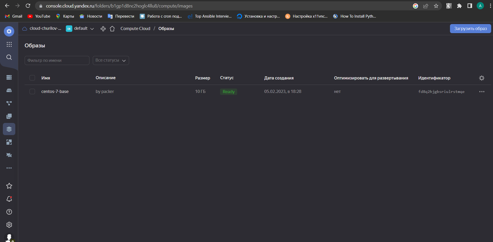

# Домашнее задание к занятию "4. Оркестрация группой Docker контейнеров на примере Docker Compose"

## Как сдавать задания

Обязательными к выполнению являются задачи без указания звездочки. Их выполнение необходимо для получения зачета и диплома о профессиональной переподготовке.

Задачи со звездочкой (*) являются дополнительными задачами и/или задачами повышенной сложности. Они не являются обязательными к выполнению, но помогут вам глубже понять тему.

Домашнее задание выполните в файле readme.md в github репозитории. В личном кабинете отправьте на проверку ссылку на .md-файл в вашем репозитории.

Любые вопросы по решению задач задавайте в чате учебной группы.

---


## Важно!

Перед отправкой работы на проверку удаляйте неиспользуемые ресурсы.
Это важно для того, чтоб предупредить неконтролируемый расход средств, полученных в результате использования промокода.

Подробные рекомендации [здесь](https://github.com/netology-code/virt-homeworks/blob/virt-11/r/README.md)

---

## Задача 1

Создать собственный образ  любой операционной системы (например, ubuntu-20.04) с помощью Packer ([инструкция](https://cloud.yandex.ru/docs/tutorials/infrastructure-management/packer-quickstart))

Для получения зачета вам необходимо предоставить скриншот страницы с созданным образом из личного кабинета YandexCloud.

## Ответ
```
ret@ret-VirtualBox:~/Desktop/packer$ packer build centos-7-base.json
yandex: output will be in this color.
 
==> yandex: Creating temporary RSA SSH key for instance...
==> yandex: Using as source image: fd8jvcoeij6u9se84dt5 (name: "centos-7-v20221121", family: "centos-7")
==> yandex: Use provided subnet id e9b6eb996l1k9516ig5e
==> yandex: Creating disk...
==> yandex: Creating instance...
==> yandex: Waiting for instance with id fhm8g175ahbir6dd3osh to become active...
    yandex: Detected instance IP: 158.160.37.57
==> yandex: Using SSH communicator to connect: 158.160.37.57
==> yandex: Waiting for SSH to become available...
==> yandex: Connected to SSH!
==> yandex: Provisioning with shell script: /tmp/packer-shell2156973495
    yandex: Loaded plugins: fastestmirror
    yandex: Determining fastest mirrors
    yandex:  * base: mirror.sale-dedic.com
    yandex:  * extras: mirror.yandex.ru
    yandex:  * updates: mirror.yandex.ru
    yandex: Resolving Dependencies
    yandex: --> Running transaction check
    yandex: ---> Package bind-export-libs.x86_64 32:9.11.4-26.P2.el7_9.10 will be updated
    yandex: ---> Package bind-export-libs.x86_64 32:9.11.4-26.P2.el7_9.13 will be an update
    yandex: ---> Package grub2.x86_64 1:2.02-0.87.0.1.el7.centos.9 will be updated
    yandex: ---> Package grub2.x86_64 1:2.02-0.87.0.2.el7.centos.11 will be an update
    yandex: ---> Package grub2-common.noarch 1:2.02-0.87.0.1.el7.centos.9 will be updated
    yandex: ---> Package grub2-common.noarch 1:2.02-0.87.0.2.el7.centos.11 will be an update
    yandex: ---> Package grub2-pc.x86_64 1:2.02-0.87.0.1.el7.centos.9 will be updated
    yandex: ---> Package grub2-pc.x86_64 1:2.02-0.87.0.2.el7.centos.11 will be an update
    yandex: ---> Package grub2-pc-modules.noarch 1:2.02-0.87.0.1.el7.centos.9 will be updated
    yandex: ---> Package grub2-pc-modules.noarch 1:2.02-0.87.0.2.el7.centos.11 will be an update
    yandex: ---> Package grub2-tools.x86_64 1:2.02-0.87.0.1.el7.centos.9 will be updated
    yandex: ---> Package grub2-tools.x86_64 1:2.02-0.87.0.2.el7.centos.11 will be an update
    yandex: ---> Package grub2-tools-extra.x86_64 1:2.02-0.87.0.1.el7.centos.9 will be updated
    yandex: ---> Package grub2-tools-extra.x86_64 1:2.02-0.87.0.2.el7.centos.11 will be an update
    yandex: ---> Package grub2-tools-minimal.x86_64 1:2.02-0.87.0.1.el7.centos.9 will be updated
    yandex: ---> Package grub2-tools-minimal.x86_64 1:2.02-0.87.0.2.el7.centos.11 will be an update
    yandex: ---> Package kernel.x86_64 0:3.10.0-1160.83.1.el7 will be installed
    yandex: ---> Package kernel-tools.x86_64 0:3.10.0-1160.80.1.el7 will be updated
    yandex: ---> Package kernel-tools.x86_64 0:3.10.0-1160.83.1.el7 will be an update
    yandex: ---> Package kernel-tools-libs.x86_64 0:3.10.0-1160.80.1.el7 will be updated
    yandex: ---> Package kernel-tools-libs.x86_64 0:3.10.0-1160.83.1.el7 will be an update
    yandex: ---> Package kpartx.x86_64 0:0.4.9-135.el7_9 will be updated
    yandex: ---> Package kpartx.x86_64 0:0.4.9-136.el7_9 will be an update
    yandex: ---> Package krb5-libs.x86_64 0:1.15.1-54.el7_9 will be updated
    yandex: ---> Package krb5-libs.x86_64 0:1.15.1-55.el7_9 will be an update
    yandex: ---> Package python-perf.x86_64 0:3.10.0-1160.80.1.el7 will be updated
    yandex: ---> Package python-perf.x86_64 0:3.10.0-1160.83.1.el7 will be an update
    yandex: ---> Package rsync.x86_64 0:3.1.2-11.el7_9 will be updated
    yandex: ---> Package rsync.x86_64 0:3.1.2-12.el7_9 will be an update
    yandex: ---> Package sudo.x86_64 0:1.8.23-10.el7_9.2 will be updated
    yandex: ---> Package sudo.x86_64 0:1.8.23-10.el7_9.3 will be an update
    yandex: ---> Package tzdata.noarch 0:2022e-1.el7 will be updated
    yandex: ---> Package tzdata.noarch 0:2022g-1.el7 will be an update
    yandex: --> Finished Dependency Resolution
    yandex:
    yandex: Dependencies Resolved
    yandex:
    yandex: ================================================================================
    yandex:  Package               Arch     Version                         Repository
    yandex:                                                                            Size
    yandex: ================================================================================
    yandex: Installing:
    yandex:  kernel                x86_64   3.10.0-1160.83.1.el7            updates    52 M
    yandex: Updating:
    yandex:  bind-export-libs      x86_64   32:9.11.4-26.P2.el7_9.13        updates   1.1 M
    yandex:  grub2                 x86_64   1:2.02-0.87.0.2.el7.centos.11   updates    34 k
    yandex:  grub2-common          noarch   1:2.02-0.87.0.2.el7.centos.11   updates   733 k
    yandex:  grub2-pc              x86_64   1:2.02-0.87.0.2.el7.centos.11   updates    34 k
    yandex:  grub2-pc-modules      noarch   1:2.02-0.87.0.2.el7.centos.11   updates   860 k
    yandex:  grub2-tools           x86_64   1:2.02-0.87.0.2.el7.centos.11   updates   1.8 M
    yandex:  grub2-tools-extra     x86_64   1:2.02-0.87.0.2.el7.centos.11   updates   1.0 M
    yandex:  grub2-tools-minimal   x86_64   1:2.02-0.87.0.2.el7.centos.11   updates   177 k
    yandex:  kernel-tools          x86_64   3.10.0-1160.83.1.el7            updates   8.2 M
    yandex:  kernel-tools-libs     x86_64   3.10.0-1160.83.1.el7            updates   8.1 M
    yandex:  kpartx                x86_64   0.4.9-136.el7_9                 updates    81 k
    yandex:  krb5-libs             x86_64   1.15.1-55.el7_9                 updates   810 k
    yandex:  python-perf           x86_64   3.10.0-1160.83.1.el7            updates   8.2 M
    yandex:  rsync                 x86_64   3.1.2-12.el7_9                  updates   408 k
    yandex:  sudo                  x86_64   1.8.23-10.el7_9.3               updates   844 k
    yandex:  tzdata                noarch   2022g-1.el7                     updates   490 k
    yandex:
    yandex: Transaction Summary
    yandex: ================================================================================
    yandex: Install   1 Package
    yandex: Upgrade  16 Packages
    yandex:
    yandex: Total download size: 84 M
    yandex: Downloading packages:
    yandex: Delta RPMs disabled because /usr/bin/applydeltarpm not installed.
    yandex: --------------------------------------------------------------------------------
    yandex: Total                                               48 MB/s |  84 MB  00:01
    yandex: Running transaction check
    yandex: Running transaction test
    yandex: Transaction test succeeded
    yandex: Running transaction
    yandex:   Updating   : 1:grub2-common-2.02-0.87.0.2.el7.centos.11.noarch           1/33
    yandex:   Updating   : 1:grub2-tools-minimal-2.02-0.87.0.2.el7.centos.11.x86_64    2/33
    yandex:   Updating   : 1:grub2-tools-2.02-0.87.0.2.el7.centos.11.x86_64            3/33
    yandex:   Updating   : 1:grub2-tools-extra-2.02-0.87.0.2.el7.centos.11.x86_64      4/33
    yandex:   Updating   : 1:grub2-pc-modules-2.02-0.87.0.2.el7.centos.11.noarch       5/33
    yandex:   Updating   : 1:grub2-pc-2.02-0.87.0.2.el7.centos.11.x86_64               6/33
    yandex:   Updating   : kernel-tools-libs-3.10.0-1160.83.1.el7.x86_64               7/33
    yandex:   Updating   : krb5-libs-1.15.1-55.el7_9.x86_64                            8/33
    yandex:   Updating   : 32:bind-export-libs-9.11.4-26.P2.el7_9.13.x86_64            9/33
    yandex:   Updating   : kernel-tools-3.10.0-1160.83.1.el7.x86_64                   10/33
    yandex:   Updating   : 1:grub2-2.02-0.87.0.2.el7.centos.11.x86_64                 11/33
    yandex:   Updating   : tzdata-2022g-1.el7.noarch                                  12/33
    yandex:   Updating   : python-perf-3.10.0-1160.83.1.el7.x86_64                    13/33
    yandex:   Updating   : sudo-1.8.23-10.el7_9.3.x86_64                              14/33
    yandex:   Installing : kernel-3.10.0-1160.83.1.el7.x86_64                         15/33
    yandex:   Updating   : rsync-3.1.2-12.el7_9.x86_64                                16/33
    yandex:   Updating   : kpartx-0.4.9-136.el7_9.x86_64                              17/33
    yandex:   Cleanup    : 1:grub2-2.02-0.87.0.1.el7.centos.9.x86_64                  18/33
    yandex:   Cleanup    : 1:grub2-pc-2.02-0.87.0.1.el7.centos.9.x86_64               19/33
    yandex:   Cleanup    : 1:grub2-tools-extra-2.02-0.87.0.1.el7.centos.9.x86_64      20/33
    yandex:   Cleanup    : 1:grub2-pc-modules-2.02-0.87.0.1.el7.centos.9.noarch       21/33
    yandex:   Cleanup    : 1:grub2-tools-2.02-0.87.0.1.el7.centos.9.x86_64            22/33
    yandex:   Cleanup    : 1:grub2-tools-minimal-2.02-0.87.0.1.el7.centos.9.x86_64    23/33
    yandex:   Cleanup    : kernel-tools-3.10.0-1160.80.1.el7.x86_64                   24/33
    yandex:   Cleanup    : 32:bind-export-libs-9.11.4-26.P2.el7_9.10.x86_64           25/33
    yandex:   Cleanup    : 1:grub2-common-2.02-0.87.0.1.el7.centos.9.noarch           26/33
    yandex:   Cleanup    : tzdata-2022e-1.el7.noarch                                  27/33
    yandex:   Cleanup    : krb5-libs-1.15.1-54.el7_9.x86_64                           28/33
    yandex:   Cleanup    : kernel-tools-libs-3.10.0-1160.80.1.el7.x86_64              29/33
    yandex:   Cleanup    : python-perf-3.10.0-1160.80.1.el7.x86_64                    30/33
    yandex:   Cleanup    : sudo-1.8.23-10.el7_9.2.x86_64                              31/33
    yandex:   Cleanup    : rsync-3.1.2-11.el7_9.x86_64                                32/33
    yandex:   Cleanup    : kpartx-0.4.9-135.el7_9.x86_64                              33/33
    yandex:   Verifying  : kpartx-0.4.9-136.el7_9.x86_64                               1/33
    yandex:   Verifying  : 1:grub2-common-2.02-0.87.0.2.el7.centos.11.noarch           2/33
    yandex:   Verifying  : 1:grub2-tools-minimal-2.02-0.87.0.2.el7.centos.11.x86_64    3/33
    yandex:   Verifying  : rsync-3.1.2-12.el7_9.x86_64                                 4/33
    yandex:   Verifying  : kernel-3.10.0-1160.83.1.el7.x86_64                          5/33
    yandex:   Verifying  : 32:bind-export-libs-9.11.4-26.P2.el7_9.13.x86_64            6/33
    yandex:   Verifying  : kernel-tools-3.10.0-1160.83.1.el7.x86_64                    7/33
    yandex:   Verifying  : 1:grub2-tools-extra-2.02-0.87.0.2.el7.centos.11.x86_64      8/33
    yandex:   Verifying  : sudo-1.8.23-10.el7_9.3.x86_64                               9/33
    yandex:   Verifying  : krb5-libs-1.15.1-55.el7_9.x86_64                           10/33
    yandex:   Verifying  : python-perf-3.10.0-1160.83.1.el7.x86_64                    11/33
    yandex:   Verifying  : 1:grub2-pc-modules-2.02-0.87.0.2.el7.centos.11.noarch      12/33
    yandex:   Verifying  : 1:grub2-pc-2.02-0.87.0.2.el7.centos.11.x86_64              13/33
    yandex:   Verifying  : tzdata-2022g-1.el7.noarch                                  14/33
    yandex:   Verifying  : 1:grub2-2.02-0.87.0.2.el7.centos.11.x86_64                 15/33
    yandex:   Verifying  : 1:grub2-tools-2.02-0.87.0.2.el7.centos.11.x86_64           16/33
    yandex:   Verifying  : kernel-tools-libs-3.10.0-1160.83.1.el7.x86_64              17/33
    yandex:   Verifying  : sudo-1.8.23-10.el7_9.2.x86_64                              18/33
    yandex:   Verifying  : 1:grub2-tools-extra-2.02-0.87.0.1.el7.centos.9.x86_64      19/33
    yandex:   Verifying  : kpartx-0.4.9-135.el7_9.x86_64                              20/33
    yandex:   Verifying  : 1:grub2-pc-2.02-0.87.0.1.el7.centos.9.x86_64               21/33
    yandex:   Verifying  : 1:grub2-tools-minimal-2.02-0.87.0.1.el7.centos.9.x86_64    22/33
    yandex:   Verifying  : rsync-3.1.2-11.el7_9.x86_64                                23/33
    yandex:   Verifying  : 1:grub2-tools-2.02-0.87.0.1.el7.centos.9.x86_64            24/33
    yandex:   Verifying  : 1:grub2-2.02-0.87.0.1.el7.centos.9.x86_64                  25/33
    yandex:   Verifying  : 1:grub2-pc-modules-2.02-0.87.0.1.el7.centos.9.noarch       26/33
    yandex:   Verifying  : 32:bind-export-libs-9.11.4-26.P2.el7_9.10.x86_64           27/33
    yandex:   Verifying  : tzdata-2022e-1.el7.noarch                                  28/33
    yandex:   Verifying  : python-perf-3.10.0-1160.80.1.el7.x86_64                    29/33
    yandex:   Verifying  : kernel-tools-libs-3.10.0-1160.80.1.el7.x86_64              30/33
    yandex:   Verifying  : 1:grub2-common-2.02-0.87.0.1.el7.centos.9.noarch           31/33
    yandex:   Verifying  : kernel-tools-3.10.0-1160.80.1.el7.x86_64                   32/33
    yandex:   Verifying  : krb5-libs-1.15.1-54.el7_9.x86_64                           33/33
    yandex:
    yandex: Installed:
    yandex:   kernel.x86_64 0:3.10.0-1160.83.1.el7
    yandex:
    yandex: Updated:
    yandex:   bind-export-libs.x86_64 32:9.11.4-26.P2.el7_9.13
    yandex:   grub2.x86_64 1:2.02-0.87.0.2.el7.centos.11
    yandex:   grub2-common.noarch 1:2.02-0.87.0.2.el7.centos.11
    yandex:   grub2-pc.x86_64 1:2.02-0.87.0.2.el7.centos.11
    yandex:   grub2-pc-modules.noarch 1:2.02-0.87.0.2.el7.centos.11
    yandex:   grub2-tools.x86_64 1:2.02-0.87.0.2.el7.centos.11
    yandex:   grub2-tools-extra.x86_64 1:2.02-0.87.0.2.el7.centos.11
    yandex:   grub2-tools-minimal.x86_64 1:2.02-0.87.0.2.el7.centos.11
    yandex:   kernel-tools.x86_64 0:3.10.0-1160.83.1.el7
    yandex:   kernel-tools-libs.x86_64 0:3.10.0-1160.83.1.el7
    yandex:   kpartx.x86_64 0:0.4.9-136.el7_9
    yandex:   krb5-libs.x86_64 0:1.15.1-55.el7_9
    yandex:   python-perf.x86_64 0:3.10.0-1160.83.1.el7
    yandex:   rsync.x86_64 0:3.1.2-12.el7_9
    yandex:   sudo.x86_64 0:1.8.23-10.el7_9.3
    yandex:   tzdata.noarch 0:2022g-1.el7
    yandex:
    yandex: Complete!
    yandex: Loaded plugins: fastestmirror
    yandex: Loading mirror speeds from cached hostfile
    yandex:  * base: mirror.sale-dedic.com
    yandex:  * extras: mirror.yandex.ru
    yandex:  * updates: mirror.yandex.ru
    yandex: Package iptables-1.4.21-35.el7.x86_64 already installed and latest version
    yandex: Package curl-7.29.0-59.el7_9.1.x86_64 already installed and latest version
    yandex: Package net-tools-2.0-0.25.20131004git.el7.x86_64 already installed and latest version
    yandex: Package rsync-3.1.2-12.el7_9.x86_64 already installed and latest version
    yandex: Package openssh-server-7.4p1-22.el7_9.x86_64 already installed and latest version
    yandex: Resolving Dependencies
    yandex: --> Running transaction check
    yandex: ---> Package bind-utils.x86_64 32:9.11.4-26.P2.el7_9.13 will be installed
    yandex: --> Processing Dependency: bind-libs-lite(x86-64) = 32:9.11.4-26.P2.el7_9.13 for package: 32:bind-utils-9.11.4-26.P2.el7_9.13.x86_64
    yandex: --> Processing Dependency: bind-libs(x86-64) = 32:9.11.4-26.P2.el7_9.13 for package: 32:bind-utils-9.11.4-26.P2.el7_9.13.x86_64
    yandex: --> Processing Dependency: liblwres.so.160()(64bit) for package: 32:bind-utils-9.11.4-26.P2.el7_9.13.x86_64
    yandex: --> Processing Dependency: libisccfg.so.160()(64bit) for package: 32:bind-utils-9.11.4-26.P2.el7_9.13.x86_64
    yandex: --> Processing Dependency: libisc.so.169()(64bit) for package: 32:bind-utils-9.11.4-26.P2.el7_9.13.x86_64
    yandex: --> Processing Dependency: libirs.so.160()(64bit) for package: 32:bind-utils-9.11.4-26.P2.el7_9.13.x86_64
    yandex: --> Processing Dependency: libdns.so.1102()(64bit) for package: 32:bind-utils-9.11.4-26.P2.el7_9.13.x86_64
    yandex: --> Processing Dependency: libbind9.so.160()(64bit) for package: 32:bind-utils-9.11.4-26.P2.el7_9.13.x86_64
    yandex: --> Processing Dependency: libGeoIP.so.1()(64bit) for package: 32:bind-utils-9.11.4-26.P2.el7_9.13.x86_64
    yandex: ---> Package bridge-utils.x86_64 0:1.5-9.el7 will be installed
    yandex: ---> Package tcpdump.x86_64 14:4.9.2-4.el7_7.1 will be installed
    yandex: --> Processing Dependency: libpcap >= 14:1.5.3-10 for package: 14:tcpdump-4.9.2-4.el7_7.1.x86_64
    yandex: --> Processing Dependency: libpcap.so.1()(64bit) for package: 14:tcpdump-4.9.2-4.el7_7.1.x86_64
    yandex: ---> Package telnet.x86_64 1:0.17-66.el7 will be installed
    yandex: --> Running transaction check
    yandex: ---> Package GeoIP.x86_64 0:1.5.0-14.el7 will be installed
    yandex: --> Processing Dependency: geoipupdate for package: GeoIP-1.5.0-14.el7.x86_64
    yandex: ---> Package bind-libs.x86_64 32:9.11.4-26.P2.el7_9.13 will be installed
    yandex: --> Processing Dependency: bind-license = 32:9.11.4-26.P2.el7_9.13 for package: 32:bind-libs-9.11.4-26.P2.el7_9.13.x86_64
    yandex: ---> Package bind-libs-lite.x86_64 32:9.11.4-26.P2.el7_9.13 will be installed
    yandex: ---> Package libpcap.x86_64 14:1.5.3-13.el7_9 will be installed
    yandex: --> Running transaction check
    yandex: ---> Package bind-license.noarch 32:9.11.4-26.P2.el7_9.13 will be installed
    yandex: ---> Package geoipupdate.x86_64 0:2.5.0-1.el7 will be installed
    yandex: --> Finished Dependency Resolution
    yandex:
    yandex: Dependencies Resolved
    yandex:
    yandex: ================================================================================
    yandex:  Package            Arch       Version                        Repository   Size
    yandex: ================================================================================
    yandex: Installing:
    yandex:  bind-utils         x86_64     32:9.11.4-26.P2.el7_9.13       updates     262 k
    yandex:  bridge-utils       x86_64     1.5-9.el7                      base         32 k
    yandex:  tcpdump            x86_64     14:4.9.2-4.el7_7.1             base        422 k
    yandex:  telnet             x86_64     1:0.17-66.el7                  updates      64 k
    yandex: Installing for dependencies:
    yandex:  GeoIP              x86_64     1.5.0-14.el7                   base        1.5 M
    yandex:  bind-libs          x86_64     32:9.11.4-26.P2.el7_9.13       updates     158 k
    yandex:  bind-libs-lite     x86_64     32:9.11.4-26.P2.el7_9.13       updates     1.1 M
    yandex:  bind-license       noarch     32:9.11.4-26.P2.el7_9.13       updates      92 k
    yandex:  geoipupdate        x86_64     2.5.0-1.el7                    base         35 k
    yandex:  libpcap            x86_64     14:1.5.3-13.el7_9              updates     139 k
    yandex:
    yandex: Transaction Summary
    yandex: ================================================================================
    yandex: Install  4 Packages (+6 Dependent packages)
    yandex:
    yandex: Total download size: 3.8 M
    yandex: Installed size: 9.0 M
    yandex: Downloading packages:
    yandex: --------------------------------------------------------------------------------
    yandex: Total                                              8.6 MB/s | 3.8 MB  00:00
    yandex: Running transaction check
    yandex: Running transaction test
    yandex: Transaction test succeeded
    yandex: Running transaction
    yandex:   Installing : 32:bind-license-9.11.4-26.P2.el7_9.13.noarch                1/10
    yandex:   Installing : geoipupdate-2.5.0-1.el7.x86_64                              2/10
    yandex:   Installing : GeoIP-1.5.0-14.el7.x86_64                                   3/10
    yandex:   Installing : 32:bind-libs-lite-9.11.4-26.P2.el7_9.13.x86_64              4/10
    yandex:   Installing : 32:bind-libs-9.11.4-26.P2.el7_9.13.x86_64                   5/10
    yandex:   Installing : 14:libpcap-1.5.3-13.el7_9.x86_64                            6/10
    yandex: pam_tally2: Error opening /var/log/tallylog for update: Permission denied
    yandex: pam_tally2: Authentication error
    yandex: useradd: failed to reset the tallylog entry of user "tcpdump"
    yandex:   Installing : 14:tcpdump-4.9.2-4.el7_7.1.x86_64                           7/10
    yandex:   Installing : 32:bind-utils-9.11.4-26.P2.el7_9.13.x86_64                  8/10
    yandex:   Installing : bridge-utils-1.5-9.el7.x86_64                               9/10
    yandex:   Installing : 1:telnet-0.17-66.el7.x86_64                                10/10
    yandex:   Verifying  : GeoIP-1.5.0-14.el7.x86_64                                   1/10
    yandex:   Verifying  : 14:libpcap-1.5.3-13.el7_9.x86_64                            2/10
    yandex:   Verifying  : 1:telnet-0.17-66.el7.x86_64                                 3/10
    yandex:   Verifying  : 32:bind-license-9.11.4-26.P2.el7_9.13.noarch                4/10
    yandex:   Verifying  : geoipupdate-2.5.0-1.el7.x86_64                              5/10
    yandex:   Verifying  : 14:tcpdump-4.9.2-4.el7_7.1.x86_64                           6/10
    yandex:   Verifying  : 32:bind-utils-9.11.4-26.P2.el7_9.13.x86_64                  7/10
    yandex:   Verifying  : 32:bind-libs-lite-9.11.4-26.P2.el7_9.13.x86_64              8/10
    yandex:   Verifying  : 32:bind-libs-9.11.4-26.P2.el7_9.13.x86_64                   9/10
    yandex:   Verifying  : bridge-utils-1.5-9.el7.x86_64                              10/10
    yandex:
    yandex: Installed:
    yandex:   bind-utils.x86_64 32:9.11.4-26.P2.el7_9.13   bridge-utils.x86_64 0:1.5-9.el7
    yandex:   tcpdump.x86_64 14:4.9.2-4.el7_7.1            telnet.x86_64 1:0.17-66.el7
    yandex:
    yandex: Dependency Installed:
    yandex:   GeoIP.x86_64 0:1.5.0-14.el7
    yandex:   bind-libs.x86_64 32:9.11.4-26.P2.el7_9.13
    yandex:   bind-libs-lite.x86_64 32:9.11.4-26.P2.el7_9.13
    yandex:   bind-license.noarch 32:9.11.4-26.P2.el7_9.13
    yandex:   geoipupdate.x86_64 0:2.5.0-1.el7
    yandex:   libpcap.x86_64 14:1.5.3-13.el7_9
    yandex:
    yandex: Complete!
==> yandex: Stopping instance...
==> yandex: Deleting instance...
    yandex: Instance has been deleted!
==> yandex: Creating image: centos-7-base
==> yandex: Waiting for image to complete...
==> yandex: Success image create...
==> yandex: Destroying boot disk...
    yandex: Disk has been deleted!
Build 'yandex' finished after 4 minutes 29 seconds.
 
==> Wait completed after 4 minutes 29 seconds
 
==> Builds finished. The artifacts of successful builds are:
--> yandex: A disk image was created: centos-7-base (id: fd8q2hjgbsriulrstmqe) with family name centos
ret@ret-VirtualBox:~/Desktop/packer$ 
```

<p align="center">
  
</p>


## Задача 2

Создать вашу первую виртуальную машину в YandexCloud с помощью terraform. 
Используйте terraform код в директории ([src/terraform](https://github.com/netology-group/virt-homeworks/tree/virt-11/05-virt-04-docker-compose/src/terraform))

Для получения зачета, вам необходимо предоставить вывод команды terraform apply и страницы свойств созданной ВМ из личного кабинета YandexCloud.

##Ответ
```
ret@ret-VirtualBox:~/Desktop/terraform/src/my_terraform$ terraform apply
yandex_compute_instance.node[1]: Refreshing state... [id=fhme3ll11ul4ivqd48pe]
yandex_compute_instance.node[0]: Refreshing state... [id=fhmiacotlaqamsbq4s8c]
 
Terraform used the selected providers to generate the following execution plan.
Resource actions are indicated with the following symbols:
  + create
 
Terraform will perform the following actions:
 
  # yandex_compute_instance.node[0] will be created
  + resource "yandex_compute_instance" "node" {
      + allow_stopping_for_update = true
      + created_at                = (known after apply)
      + description               = "node-01"
      + folder_id                 = "b1gp1d8nc2hoglc4llu8"
      + fqdn                      = (known after apply)
      + hostname                  = "node-01"
      + id                        = (known after apply)
      + metadata                  = {
          + "ssh-keys" = <<-EOT
                centos:ssh-rsa AAAAB3NzaC1yc2EAAAADAQABAAABgQDAnEJwnudIJw3Td4/yuX4fL7+4B4e+X7FgGvnL+getPvVfeFB2CEE6qlfu4DlRHDBHUwRd7QQdw4HbJenE+t590kdsQuIdRUo4WCKAHe9Gi9JEkQ7N2yN7O6vv4q2i7vaW6mJBG9BQ5icmuAz+wKZs/2P2yXFze5genuJ4p/uPTsYvRraBM/RGaGh9WLbJ/nxxTabOaqCovbrKZhWfkn5Q4a65LPYIrWPH/6pEDU2+XBxXpWx0xFpvZbKuXZEnY88tI4Rm8bPGGH6hyXDDhTP4eDhFBU3kEDGhg9jxRH/fkvaSEtRX/V6yBZvPJoRv4tSrqH+JUpthfjAgLpIez+Vs14HNOhiKFHOFn5KcnrWGXurpa/649a3jmPwNAyu0vzgRP1HJYxZP21LwnFKX4XyXre6vFfDZLN9ybrluGVEab6/2M+F/Ujws/V0ur50uIrrKGyIrGvjLsK4OtOKtrbJQ2QXsiVbBOPW2tWLw1JAfnEz9EE5eglsed8Pcc6Xg+Kc= ret@ret-VirtualBox
            EOT
        }
      + name                      = "node-01"
      + network_acceleration_type = "standard"
      + platform_id               = "standard-v2"
      + service_account_id        = (known after apply)
      + status                    = (known after apply)
      + zone                      = "ru-central1-a"
 
      + boot_disk {
          + auto_delete = true
          + device_name = (known after apply)
          + disk_id     = (known after apply)
          + mode        = (known after apply)
 
          + initialize_params {
              + block_size  = (known after apply)
              + description = (known after apply)
              + image_id    = "fd8q2hjgbsriulrstmqe"
              + name        = (known after apply)
              + size        = 30
              + snapshot_id = (known after apply)
              + type        = "network-ssd"
            }
        }
 
      + metadata_options {
          + aws_v1_http_endpoint = (known after apply)
          + aws_v1_http_token    = (known after apply)
          + gce_http_endpoint    = (known after apply)
          + gce_http_token       = (known after apply)
        }
 
      + network_interface {
          + index              = (known after apply)
          + ip_address         = (known after apply)
          + ipv4               = true
          + ipv6               = (known after apply)
          + ipv6_address       = (known after apply)
          + mac_address        = (known after apply)
          + nat                = true
          + nat_ip_address     = (known after apply)
          + nat_ip_version     = (known after apply)
          + security_group_ids = (known after apply)
          + subnet_id          = "e9b6eb996l1k9516ig5e"
        }
 
      + placement_policy {
          + host_affinity_rules = (known after apply)
          + placement_group_id  = (known after apply)
        }
 
      + resources {
          + core_fraction = 100
          + cores         = 2
          + memory        = 4
        }
 
      + scheduling_policy {
          + preemptible = (known after apply)
        }
    }
 
Plan: 1 to add, 0 to change, 0 to destroy.
 
Do you want to perform these actions?
  Terraform will perform the actions described above.
  Only 'yes' will be accepted to approve.
 
  Enter a value: yes
 
yandex_compute_instance.node[0]: Creating...
yandex_compute_instance.node[0]: Still creating... [10s elapsed]
yandex_compute_instance.node[0]: Still creating... [20s elapsed]
yandex_compute_instance.node[0]: Still creating... [30s elapsed]
yandex_compute_instance.node[0]: Still creating... [40s elapsed]
yandex_compute_instance.node[0]: Still creating... [50s elapsed]
yandex_compute_instance.node[0]: Still creating... [1m0s elapsed]
yandex_compute_instance.node[0]: Creation complete after 1m2s [id=fhm2g851hpumm724omhi]
 
Apply complete! Resources: 1 added, 0 changed, 0 destroyed.
ret@ret-VirtualBox:~/Desktop/terraform/src/my_terraform$
```
<p align="center">
  
</p>

## Задача 3

С помощью ansible и docker-compose разверните на виртуальной машине из предыдущего задания систему мониторинга на основе Prometheus/Grafana .
Используйте ansible код в директории ([src/ansible](https://github.com/netology-group/virt-homeworks/tree/virt-11/05-virt-04-docker-compose/src/ansible))

Для получения зачета вам необходимо предоставить вывод команды "docker ps" , все контейнеры, описанные в ([docker-compose](https://github.com/netology-group/virt-homeworks/blob/virt-11/05-virt-04-docker-compose/src/ansible/stack/docker-compose.yaml)),  должны быть в статусе "Up".

## Ответ

```
[centos@node-01 ~]$ sudo docker ps
CONTAINER ID   IMAGE                                       COMMAND                  CREATED              STATUS                    PORTS                                                                              NAMES
65f6147c4f46   stefanprodan/caddy                          "/sbin/tini -- caddy…"   About a minute ago   Up 45 seconds             0.0.0.0:3000->3000/tcp, 0.0.0.0:9090-9091->9090-9091/tcp, 0.0.0.0:9093->9093/tcp   caddy
0e7e2410ca62   prom/pushgateway:v1.2.0                     "/bin/pushgateway"       About a minute ago   Up 46 seconds             9091/tcp                                                                           pushgateway
18a2c3d30a82   gcr.io/google-containers/cadvisor:v0.34.0   "/usr/bin/cadvisor -…"   About a minute ago   Up 45 seconds (healthy)   8080/tcp                                                                           cadvisor
ab3f14f8e91f   grafana/grafana:7.4.2                       "/run.sh"                About a minute ago   Up 45 seconds             3000/tcp                                                                           grafana
03aec094547d   prom/node-exporter:v0.18.1                  "/bin/node_exporter …"   About a minute ago   Up 45 seconds             9100/tcp                                                                           nodeexporter
309b9423b4eb   prom/prometheus:v2.17.1                     "/bin/prometheus --c…"   About a minute ago   Up 45 seconds             9090/tcp                                                                           prometheus
b4f19fc34861   prom/alertmanager:v0.20.0                   "/bin/alertmanager -…"   About a minute ago   Up 46 seconds             9093/tcp                                                                           alertmanager
[centos@node-01 ~]$ 
```

## Задача 4

1. Откройте веб-браузер, зайдите на страницу http://<внешний_ip_адрес_вашей_ВМ>:3000.
2. Используйте для авторизации логин и пароль из ([.env-file](https://github.com/netology-group/virt-homeworks/blob/virt-11/05-virt-04-docker-compose/src/ansible/stack/.env)).
3. Изучите доступный интерфейс, найдите в интерфейсе автоматически созданные docker-compose панели с графиками([dashboards](https://grafana.com/docs/grafana/latest/dashboards/use-dashboards/)).
4. Подождите 5-10 минут, чтобы система мониторинга успела накопить данные.

Для получения зачета, вам необходимо предоставить: 
- Скриншот работающего веб-интерфейса Grafana с текущими метриками, как на примере ниже
<p align="center">
  
</p>

## Ответ

IP не совпадает, т.к. машины создавал в разное время

<p align="center">
  
</p>

<p align="center">
  
</p>

## Задача 5 (*)

Создать вторую ВМ и подключить её к мониторингу развёрнутому на первом сервере.

Для получения зачета, вам необходимо предоставить:
- Скриншот из Grafana, на котором будут отображаться метрики добавленного вами сервера.

## Ответ

<p align="center">
  
</p>

<p align="center">
  
</p>

<p align="center">
  
</p>