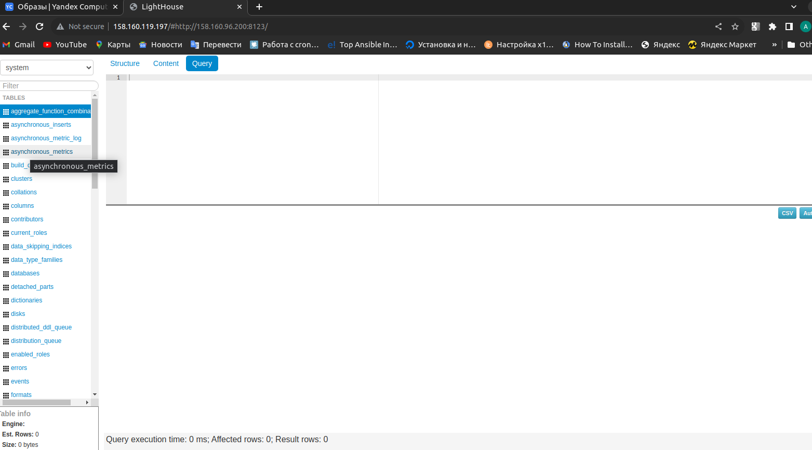

# Домашнее задание к занятию 3 «Использование Ansible»

Подготовьте в Yandex Cloud три хоста: для `clickhouse`, для `vector` и для `lighthouse`.
```
Сделано c помощью terraform из папки terraform:

  "outputs": {
    "public_ip": {
      "value": [
        "clickhouse-01 158.160.96.200",
        "lighthouse-01 158.160.119.197",
        "vector-01 158.160.111.13"
      ]

```

1. Допишите playbook: нужно сделать ещё один play, который устанавливает и настраивает LightHouse.
```
В playbook 4 play: play на установку Nginx сервера и play на установку lighthouse на одной ВМ, play на установку vector и play на установку clickhouse
```
2. При создании tasks рекомендую использовать модули: `get_url`, `template`, `yum`, `apt`.
```
Выполнено
```
3. Tasks должны: скачать статику LightHouse, установить Nginx или любой другой веб-сервер, настроить его конфиг для открытия LightHouse, запустить веб-сервер.
```
ret@ret-vm:~/Desktop/net/Ready/08-ansible-03-yandex/playbook$ ansible-playbook -u centos site.yml -i inventory/prod.yml 

PLAY [Clickhouse] **************************************************************

TASK [Gathering Facts] *********************************************************
The authenticity of host '158.160.96.200 (158.160.96.200)' can't be established.
ED25519 key fingerprint is SHA256:utRF8GR5OwMqsog4o0jCBjXl5N2pajgGBUhS/mrbf6k.
This key is not known by any other names
Are you sure you want to continue connecting (yes/no/[fingerprint])? yes
ok: [clickhouse-01]

TASK [CH | get distrib] ********************************************************
changed: [clickhouse-01] => (item=clickhouse-client)
changed: [clickhouse-01] => (item=clickhouse-server)
failed: [clickhouse-01] (item=clickhouse-common-static) => {"ansible_loop_var": "item", "changed": false, "dest": "./clickhouse-common-static-22.3.3.44.rpm", "elapsed": 0, "item": "clickhouse-common-static", "msg": "Request failed", "response": "HTTP Error 404: Not Found", "status_code": 404, "url": "https://packages.clickhouse.com/rpm/stable/clickhouse-common-static-22.3.3.44.noarch.rpm"}

TASK [CH | get distrib] ********************************************************
changed: [clickhouse-01]

TASK [CH | install packeges] ***************************************************
changed: [clickhouse-01]

TASK [CH | change config] ******************************************************
changed: [clickhouse-01]

TASK [CH | flush handlers] *****************************************************

RUNNING HANDLER [Start clickhouse service] *************************************
changed: [clickhouse-01]

TASK [CH | wait server] ********************************************************
ok: [clickhouse-01]

TASK [CH | create DB] **********************************************************
changed: [clickhouse-01]

PLAY [Nginx] *******************************************************************

TASK [Gathering Facts] *********************************************************
The authenticity of host '158.160.119.197 (158.160.119.197)' can't be established.
ED25519 key fingerprint is SHA256:0uaBBUv+cbYczTCG7slp4fs+PKBzSGlZNNAaflaeAsw.
This key is not known by any other names
Are you sure you want to continue connecting (yes/no/[fingerprint])? yes
ok: [lighthouse-01]

TASK [Nginx | install repo] ****************************************************
changed: [lighthouse-01]

TASK [Nginx | install nginx] ***************************************************
changed: [lighthouse-01]

TASK [Create config nginx] *****************************************************
changed: [lighthouse-01]

RUNNING HANDLER [start_nginx] **************************************************
changed: [lighthouse-01]

PLAY [Lighhouse] ***************************************************************

TASK [Gathering Facts] *********************************************************
ok: [lighthouse-01]

TASK [LH | install git] ********************************************************
changed: [lighthouse-01]

TASK [LH | download distrib] ***************************************************
changed: [lighthouse-01]

TASK [LH | config] *************************************************************
changed: [lighthouse-01]

RUNNING HANDLER [reload_nginx] *************************************************
changed: [lighthouse-01]

PLAY [Vector] ******************************************************************

TASK [Gathering Facts] *********************************************************
The authenticity of host '158.160.111.13 (158.160.111.13)' can't be established.
ED25519 key fingerprint is SHA256:uuN/QhDCR104+PBpL32hYyCeQGoNUie7SUDolw2JePA.
This key is not known by any other names
Are you sure you want to continue connecting (yes/no/[fingerprint])? yes
ok: [vector-01]

TASK [Vector | Install package] ************************************************
changed: [vector-01]

TASK [Vector | Template config] ************************************************
changed: [vector-01]

TASK [Vector | create systemd unit] ********************************************
changed: [vector-01]

TASK [Vector | Start service] **************************************************
changed: [vector-01]

PLAY RECAP *********************************************************************
clickhouse-01              : ok=7    changed=5    unreachable=0    failed=0    skipped=0    rescued=1    ignored=0   
lighthouse-01              : ok=10   changed=8    unreachable=0    failed=0    skipped=0    rescued=0    ignored=0   
vector-01                  : ok=5    changed=4    unreachable=0    failed=0    skipped=0    rescued=0    ignored=0   

ret@ret-vm:~/Desktop/net/Ready/08-ansible-03-yandex/playbook$ 
```
```
получилось вот так:
```
<p align="center">
  
</p>


4. Подготовьте свой inventory-файл `prod.yml`.
```
ret@test-netology:~/Desktop/!!!!homework/devops-netology/08-ansible-03-yandex/playbook/inventory$ cat prod.yml 
---
vector:
  hosts:
    vector-01:
      ansible_host: 158.160.111.13
clickhouse:
  hosts:
    clickhouse-01:
      ansible_host: 158.160.96.200
lighthouse:
  hosts:
    lighthouse-01:
      ansible_host: 158.160.119.197
ret@test-netology:~/Desktop/!!!!homework/devops-netology/08-ansible-03-yandex/playbook/inventory$ 
```
5. Запустите `ansible-lint site.yml` и исправьте ошибки, если они есть.
```
ret@ret-vm:~/Desktop/net/Ready/08-ansible-03-yandex/playbook$ ansible-lint site.yml
WARNING  Listing 10 violation(s) that are fatal
name[missing]: All tasks should be named.
site.yml:14 Task/Handler: block/always/rescue 

yaml[octal-values]: Forbidden implicit octal value "0444"
site.yml:19

yaml[octal-values]: Forbidden implicit octal value "0444"
site.yml:26

jinja[spacing]: Jinja2 spacing could be improved: create_db.rc != 0 and create_db.rc !=82 -> create_db.rc != 0 and create_db.rc != 82 (warning)
site.yml:47 Jinja2 template rewrite recommendation: `create_db.rc != 0 and create_db.rc != 82`.

name[casing]: All names should start with an uppercase letter.
site.yml:59 Task/Handler: start_nginx

no-changed-when: Commands should not change things if nothing needs doing.
site.yml:59 Task/Handler: start_nginx

yaml[octal-values]: Forbidden implicit octal value "0644"
site.yml:78

name[casing]: All names should start with an uppercase letter.
site.yml:85 Task/Handler: reload_nginx

no-changed-when: Commands should not change things if nothing needs doing.
site.yml:85 Task/Handler: reload_nginx

yaml[octal-values]: Forbidden implicit octal value "0644"
site.yml:107

Read documentation for instructions on how to ignore specific rule violations.

                    Rule Violation Summary                    
 count tag                profile  rule associated tags       
     1 jinja[spacing]     basic    formatting (warning)       
     1 name[missing]      basic    idiom                      
     4 yaml[octal-values] basic    formatting, yaml           
     2 name[casing]       moderate idiom                      
     2 no-changed-when    shared   command-shell, idempotency 

Failed: 9 failure(s), 1 warning(s) on 1 files. Last profile that met the validation criteria was 'min'.
ret@ret-vm:~/Desktop/net/Ready/08-ansible-03-yandex/playbook$ ansible-lint site.yml

Passed: 0 failure(s), 0 warning(s) on 1 files. Last profile that met the validation criteria was 'production'.
ret@ret-vm:~/Desktop/net/Ready/08-ansible-03-yandex/playbook$
```
6. Попробуйте запустить playbook на этом окружении с флагом `--check`.
```
Если ранее не установлено, то ошибка:

ret@test-netology:~/Desktop/08-ansible-03-yandex/playbook$ ansible-playbook site.yml -u centos -i inventory/prod.yml --check

PLAY [Clickhouse] **************************************************************

TASK [Gathering Facts] *********************************************************
The authenticity of host '62.84.124.114 (62.84.124.114)' can't be established.
ED25519 key fingerprint is SHA256:Uw8YIe6RJqIWru/zo5bfhdADdvb0kz4CWOfC8MaJRfM.
This key is not known by any other names
Are you sure you want to continue connecting (yes/no/[fingerprint])? yes
ok: [clickhouse-01]

TASK [Clickhouse/get distrib] **************************************************
changed: [clickhouse-01] => (item=clickhouse-client)
changed: [clickhouse-01] => (item=clickhouse-server)
failed: [clickhouse-01] (item=clickhouse-common-static) => {"ansible_loop_var": "item", "changed": false, "dest": "./clickhouse-common-static-22.3.3.44.rpm", "elapsed": 1, "item": "clickhouse-common-static", "msg": "Request failed", "response": "HTTP Error 404: Not Found", "status_code": 404, "url": "https://packages.clickhouse.com/rpm/stable/clickhouse-common-static-22.3.3.44.noarch.rpm"}

TASK [Clickhouse/get distrib] **************************************************
changed: [clickhouse-01]

TASK [Clickhouse/install packages] *********************************************
fatal: [clickhouse-01]: FAILED! => {"changed": false, "msg": "No RPM file matching 'clickhouse-common-static-22.3.3.44.rpm' found on system", "rc": 127, "results": ["No RPM file matching 'clickhouse-common-static-22.3.3.44.rpm' found on system"]}

PLAY RECAP *********************************************************************
clickhouse-01              : ok=2    changed=1    unreachable=0    failed=1    skipped=0    rescued=1    ignored=0   

ret@test-netology:~/Desktop/08-ansible-03-yandex/playbook$ 

```
```
Если установлено, то

ret@ret-vm:~/Desktop/net/Ready/08-ansible-03-yandex/playbook$ ansible-playbook site.yml -u centos -i inventory/prod.yml --check

PLAY [Clickhouse] **************************************************************

TASK [Gathering Facts] *********************************************************
ok: [clickhouse-01]

TASK [Clickhouse/get distrib] **************************************************
ok: [clickhouse-01] => (item=clickhouse-client)
ok: [clickhouse-01] => (item=clickhouse-server)
failed: [clickhouse-01] (item=clickhouse-common-static) => {"ansible_loop_var": "item", "changed": false, "dest": "./clickhouse-common-static-22.3.3.44.rpm", "elapsed": 0, "gid": 1000, "group": "centos", "item": "clickhouse-common-static", "mode": "0444", "msg": "Request failed", "owner": "centos", "response": "HTTP Error 404: Not Found", "secontext": "unconfined_u:object_r:user_home_t:s0", "size": 246310036, "state": "file", "status_code": 404, "uid": 1000, "url": "https://packages.clickhouse.com/rpm/stable/clickhouse-common-static-22.3.3.44.noarch.rpm"}

TASK [Clickhouse/get distrib] **************************************************
ok: [clickhouse-01]

TASK [Clickhouse/install packages] *********************************************
ok: [clickhouse-01]

TASK [Clickhouse/change config] ************************************************
ok: [clickhouse-01]

TASK [Clickhouse/flush handlers] ***********************************************

TASK [Clickhouse/wait server] **************************************************
skipping: [clickhouse-01]

TASK [Clickhouse/create database] **********************************************
skipping: [clickhouse-01]

PLAY [Nginx] *******************************************************************

TASK [Gathering Facts] *********************************************************
ok: [lighthouse-01]

TASK [Nginx/install repo] ******************************************************
ok: [lighthouse-01]

TASK [Nginx/install nginx] *****************************************************
ok: [lighthouse-01]

TASK [Nginx/create config nginx] ***********************************************
ok: [lighthouse-01]

PLAY [Lighhouse] ***************************************************************

TASK [Gathering Facts] *********************************************************
ok: [lighthouse-01]

TASK [Lighhouse/install git] ***************************************************
ok: [lighthouse-01]

TASK [Lighhouse/download distrib] **********************************************
ok: [lighthouse-01]

TASK [Lighhouse/config] ********************************************************
ok: [lighthouse-01]

PLAY [Vector] ******************************************************************

TASK [Gathering Facts] *********************************************************
ok: [vector-01]

TASK [Vector/Install package] **************************************************
ok: [vector-01]

TASK [Vector/Template config] **************************************************
ok: [vector-01]

TASK [Vector/Create systemd unit] **********************************************
ok: [vector-01]

TASK [Vector | Start service] **************************************************
changed: [vector-01]

PLAY RECAP *********************************************************************
clickhouse-01              : ok=4    changed=0    unreachable=0    failed=0    skipped=2    rescued=1    ignored=0   
lighthouse-01              : ok=8    changed=0    unreachable=0    failed=0    skipped=0    rescued=0    ignored=0   
vector-01                  : ok=5    changed=1    unreachable=0    failed=0    skipped=0    rescued=0    ignored=0   

ret@ret-vm:~/Desktop/net/Ready/08-ansible-03-yandex/playbook$ 
```
7. Запустите playbook на `prod.yml` окружении с флагом `--diff`. Убедитесь, что изменения на системе произведены.
```
ret@test-netology:~/Desktop/08-ansible-03-yandex/playbook$ ansible-playbook site.yml -u centos -i inventory/prod.yml --diff

PLAY [Clickhouse] **************************************************************

TASK [Gathering Facts] *********************************************************
ok: [clickhouse-01]

TASK [Clickhouse/get distrib] **************************************************
changed: [clickhouse-01] => (item=clickhouse-client)
changed: [clickhouse-01] => (item=clickhouse-server)
failed: [clickhouse-01] (item=clickhouse-common-static) => {"ansible_loop_var": "item", "changed": false, "dest": "./clickhouse-common-static-22.3.3.44.rpm", "elapsed": 0, "item": "clickhouse-common-static", "msg": "Request failed", "response": "HTTP Error 404: Not Found", "status_code": 404, "url": "https://packages.clickhouse.com/rpm/stable/clickhouse-common-static-22.3.3.44.noarch.rpm"}

TASK [Clickhouse/get distrib] **************************************************
changed: [clickhouse-01]

TASK [Clickhouse/install packages] *********************************************
changed: [clickhouse-01]

TASK [Clickhouse/change config] ************************************************
--- before: /etc/clickhouse-server/config.xml
+++ after: /etc/clickhouse-server/config.xml
@@ -180,7 +180,7 @@
 
 
     <!-- Same for hosts without support for IPv6: -->
-    <!-- <listen_host>0.0.0.0</listen_host> -->
+<listen_host>0.0.0.0</listen_host>
 
     <!-- Default values - try listen localhost on IPv4 and IPv6. -->
     <!--

changed: [clickhouse-01]

TASK [Clickhouse/flush handlers] ***********************************************

RUNNING HANDLER [Start clickhouse service] *************************************
changed: [clickhouse-01]

TASK [Clickhouse/wait server] **************************************************
ok: [clickhouse-01]

TASK [Clickhouse/create database] **********************************************
changed: [clickhouse-01]

PLAY [Nginx] *******************************************************************

TASK [Gathering Facts] *********************************************************
The authenticity of host '51.250.72.223 (51.250.72.223)' can't be established.
ED25519 key fingerprint is SHA256:XOQvhRua1jG3/8i/gYUwu9kMH8Q2zi+nzrygCzL6Aa8.
This key is not known by any other names
Are you sure you want to continue connecting (yes/no/[fingerprint])? нуы
Please type 'yes', 'no' or the fingerprint: yes
ok: [lighthouse-01]

TASK [Nginx/install repo] ******************************************************
changed: [lighthouse-01]

TASK [Nginx/install nginx] *****************************************************
changed: [lighthouse-01]

TASK [Nginx/create config nginx] ***********************************************
--- before: /etc/nginx/nginx.conf
+++ after: /home/ret/.ansible/tmp/ansible-local-16339zllxbox5/tmp83bl2yeu/nginx.conf.j2
@@ -1,84 +1,32 @@
-# For more information on configuration, see:
-#   * Official English Documentation: http://nginx.org/en/docs/
-#   * Official Russian Documentation: http://nginx.org/ru/docs/
+user root;
+worker_processes 1;
 
-user nginx;
-worker_processes auto;
-error_log /var/log/nginx/error.log;
-pid /run/nginx.pid;
+error_log /var/log/nginx/error.log warn;
+pid       /var/run/nginx.pid;
 
-# Load dynamic modules. See /usr/share/doc/nginx/README.dynamic.
-include /usr/share/nginx/modules/*.conf;
 
 events {
     worker_connections 1024;
 }
 
+
 http {
+
+    include /etc/nginx/mime.types;
+    default_type application/octet-stream;
+
     log_format  main  '$remote_addr - $remote_user [$time_local] "$request" '
                       '$status $body_bytes_sent "$http_referer" '
                       '"$http_user_agent" "$http_x_forwarded_for"';
 
     access_log  /var/log/nginx/access.log  main;
+ 
+    sendfile        on;
+    #tcp_nopush     on;
 
-    sendfile            on;
-    tcp_nopush          on;
-    tcp_nodelay         on;
-    keepalive_timeout   65;
-    types_hash_max_size 4096;
+    keepalive_timeout  65;
 
-    include             /etc/nginx/mime.types;
-    default_type        application/octet-stream;
+    #gzip  on;
 
-    # Load modular configuration files from the /etc/nginx/conf.d directory.
-    # See http://nginx.org/en/docs/ngx_core_module.html#include
-    # for more information.
     include /etc/nginx/conf.d/*.conf;
-
-    server {
-        listen       80;
-        listen       [::]:80;
-        server_name  _;
-        root         /usr/share/nginx/html;
-
-        # Load configuration files for the default server block.
-        include /etc/nginx/default.d/*.conf;
-
-        error_page 404 /404.html;
-        location = /404.html {
-        }
-
-        error_page 500 502 503 504 /50x.html;
-        location = /50x.html {
-        }
-    }
-
-# Settings for a TLS enabled server.
-#
-#    server {
-#        listen       443 ssl http2;
-#        listen       [::]:443 ssl http2;
-#        server_name  _;
-#        root         /usr/share/nginx/html;
-#
-#        ssl_certificate "/etc/pki/nginx/server.crt";
-#        ssl_certificate_key "/etc/pki/nginx/private/server.key";
-#        ssl_session_cache shared:SSL:1m;
-#        ssl_session_timeout  10m;
-#        ssl_ciphers HIGH:!aNULL:!MD5;
-#        ssl_prefer_server_ciphers on;
-#
-#        # Load configuration files for the default server block.
-#        include /etc/nginx/default.d/*.conf;
-#
-#        error_page 404 /404.html;
-#            location = /40x.html {
-#        }
-#
-#        error_page 500 502 503 504 /50x.html;
-#            location = /50x.html {
-#        }
-#    }
-
 }
-

changed: [lighthouse-01]

RUNNING HANDLER [Start_nginx] **************************************************
ok: [lighthouse-01]

PLAY [Lighhouse] ***************************************************************

TASK [Gathering Facts] *********************************************************
ok: [lighthouse-01]

TASK [Lighhouse/install git] ***************************************************
changed: [lighthouse-01]

TASK [Lighhouse/download distrib] **********************************************
>> Newly checked out d701335c25cd1bb9b5155711190bad8ab852c2ce
changed: [lighthouse-01]

TASK [Lighhouse/config] ********************************************************
--- before
+++ after: /home/ret/.ansible/tmp/ansible-local-16339zllxbox5/tmpbsi68pz3/lighthouse.conf.j2
@@ -0,0 +1,11 @@
+server {
+    listen 80;
+    server_name localhost;
+
+    access_log   /var/log/nginx/lighthouse_access.log  main;
+
+    location / {
+        root /home/ps/lighthouse;
+        index index.html;
+    }
+}

changed: [lighthouse-01]

RUNNING HANDLER [Reload_nginx] *************************************************
ok: [lighthouse-01]

PLAY [Vector] ******************************************************************

TASK [Gathering Facts] *********************************************************
The authenticity of host '51.250.80.225 (51.250.80.225)' can't be established.
ED25519 key fingerprint is SHA256:IgCkoGX7ITFyUPLE4IWmz6sryQz6C82axtCPeVNja5Q.
This key is not known by any other names
Are you sure you want to continue connecting (yes/no/[fingerprint])? yes
ok: [vector-01]

TASK [Vector/Install package] **************************************************
changed: [vector-01]

TASK [Vector/Template config] **************************************************
--- before
+++ after: /home/ret/.ansible/tmp/ansible-local-16339zllxbox5/tmp2l8wp806/vector.yml.j2
@@ -0,0 +1,18 @@
+sinks:
+    to_clickhouse:
+        compression: gzip
+        database: logs
+        endpoint: http://192.168.101.36:8123
+        healthcheck: false
+        inputs:
+        - our_log
+        skip_unknown_fields: true
+        table: my_table
+        type: clickhouse
+sources:
+    our_log:
+        ignore_older_secs: 600
+        include:
+        - /var/log/**/*.log
+        read_from: beginning
+        type: file

changed: [vector-01]

TASK [Vector/Create systemd unit] **********************************************
--- before
+++ after: /home/ret/.ansible/tmp/ansible-local-16339zllxbox5/tmp5aweaubw/vector.service.j2
@@ -0,0 +1,12 @@
+[Unit]
+Description=Vector service
+After=network.target
+Requires=network-online.target
+[Service]
+User=centos
+Group=1000
+ExecStart=/usr/bin/vector --config-yaml vector.yml --watch-config
+Restart=always
+[Install]
+WantedBy=multi-user.target
+

changed: [vector-01]

TASK [Vector | Start service] **************************************************
changed: [vector-01]

PLAY RECAP *********************************************************************
clickhouse-01              : ok=7    changed=5    unreachable=0    failed=0    skipped=0    rescued=1    ignored=0   
lighthouse-01              : ok=10   changed=6    unreachable=0    failed=0    skipped=0    rescued=0    ignored=0   
vector-01                  : ok=5    changed=4    unreachable=0    failed=0    skipped=0    rescued=0    ignored=0   

ret@test-netology:~/Desktop/08-ansible-03-yandex/playbook$
```
8. Повторно запустите playbook с флагом `--diff` и убедитесь, что playbook идемпотентен.
```
ret@test-netology:~/Desktop/08-ansible-03-yandex/playbook$ ansible-playbook site.yml -u centos -i inventory/prod.yml --diff

PLAY [Clickhouse] **************************************************************

TASK [Gathering Facts] *********************************************************
ok: [clickhouse-01]

TASK [Clickhouse/get distrib] **************************************************
ok: [clickhouse-01] => (item=clickhouse-client)
ok: [clickhouse-01] => (item=clickhouse-server)
failed: [clickhouse-01] (item=clickhouse-common-static) => {"ansible_loop_var": "item", "changed": false, "dest": "./clickhouse-common-static-22.3.3.44.rpm", "elapsed": 0, "gid": 1000, "group": "centos", "item": "clickhouse-common-static", "mode": "0444", "msg": "Request failed", "owner": "centos", "response": "HTTP Error 404: Not Found", "secontext": "unconfined_u:object_r:user_home_t:s0", "size": 246310036, "state": "file", "status_code": 404, "uid": 1000, "url": "https://packages.clickhouse.com/rpm/stable/clickhouse-common-static-22.3.3.44.noarch.rpm"}

TASK [Clickhouse/get distrib] **************************************************
ok: [clickhouse-01]

TASK [Clickhouse/install packages] *********************************************
ok: [clickhouse-01]

TASK [Clickhouse/change config] ************************************************
ok: [clickhouse-01]

TASK [Clickhouse/flush handlers] ***********************************************

TASK [Clickhouse/wait server] **************************************************
ok: [clickhouse-01]

TASK [Clickhouse/create database] **********************************************
ok: [clickhouse-01]

PLAY [Nginx] *******************************************************************

TASK [Gathering Facts] *********************************************************
ok: [lighthouse-01]

TASK [Nginx/install repo] ******************************************************
ok: [lighthouse-01]

TASK [Nginx/install nginx] *****************************************************
ok: [lighthouse-01]

TASK [Nginx/create config nginx] ***********************************************
ok: [lighthouse-01]

PLAY [Lighhouse] ***************************************************************

TASK [Gathering Facts] *********************************************************
ok: [lighthouse-01]

TASK [Lighhouse/install git] ***************************************************
ok: [lighthouse-01]

TASK [Lighhouse/download distrib] **********************************************
ok: [lighthouse-01]

TASK [Lighhouse/config] ********************************************************
ok: [lighthouse-01]

PLAY [Vector] ******************************************************************

TASK [Gathering Facts] *********************************************************
ok: [vector-01]

TASK [Vector/Install package] **************************************************
ok: [vector-01]

TASK [Vector/Template config] **************************************************
ok: [vector-01]

TASK [Vector/Create systemd unit] **********************************************
ok: [vector-01]

TASK [Vector | Start service] **************************************************
changed: [vector-01]

PLAY RECAP *********************************************************************
clickhouse-01              : ok=6    changed=0    unreachable=0    failed=0    skipped=0    rescued=1    ignored=0   
lighthouse-01              : ok=8    changed=0    unreachable=0    failed=0    skipped=0    rescued=0    ignored=0   
vector-01                  : ok=5    changed=1    unreachable=0    failed=0    skipped=0    rescued=0    ignored=0   

ret@test-netology:~/Desktop/08-ansible-03-yandex/playbook$ 

```
9. Подготовьте README.md-файл по своему playbook. В нём должно быть описано: что делает playbook, какие у него есть параметры и теги.
```
Playbook содержит 4 play-я . Каждый Play содержит в себе task-и по установке Clickhouse, Vector, Lighthouse и Nginx соответственно. 
Каждый play можно выполнить отдельно, используя тэги: clickhouse, vector, lighthouse, nginx.
Плейбук использует 3 файла с переменными индивидуально для каждой из группы хостов.
Так-же используются шаблоны конфигураций сервисов.
```
10. Готовый playbook выложите в свой репозиторий, поставьте тег `08-ansible-03-yandex` на фиксирующий коммит, в ответ предоставьте ссылку на него.

