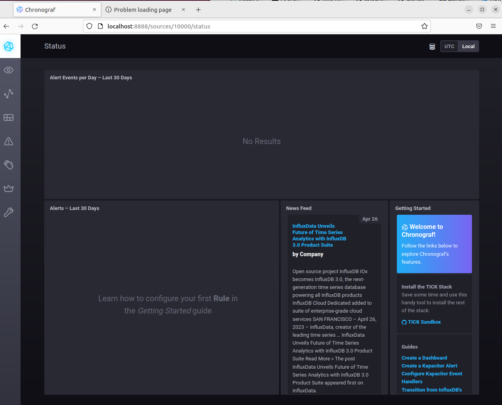
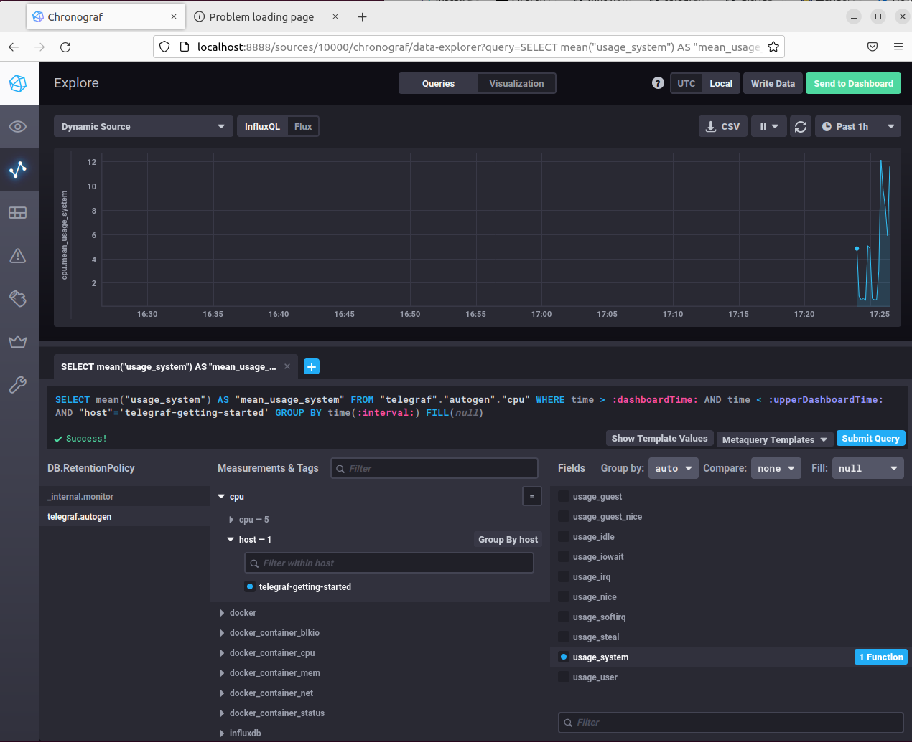
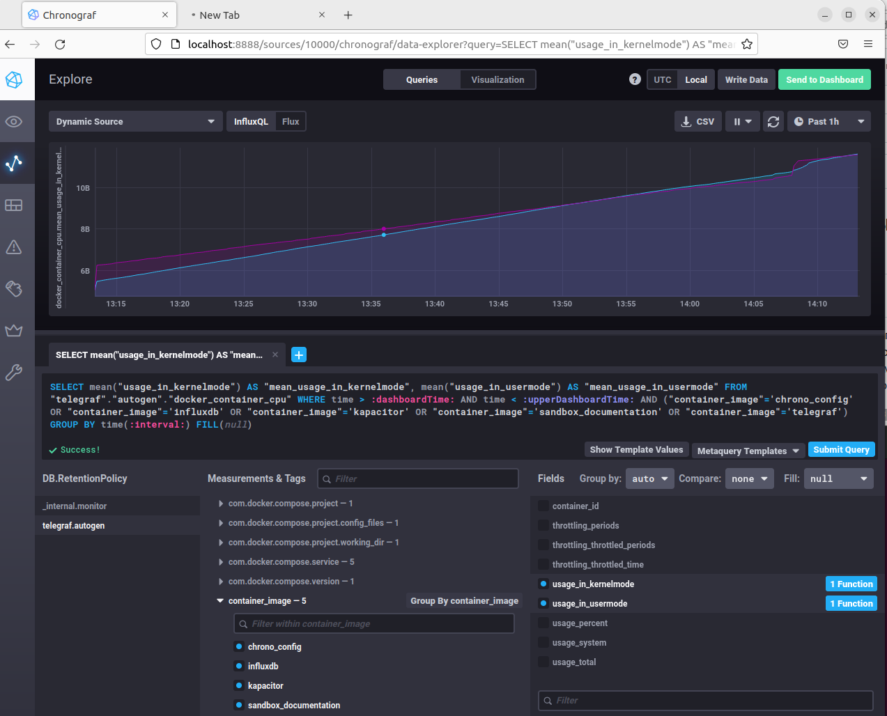

# Домашнее задание к занятию "13.Системы мониторинга"

## Обязательные задания

1. Вас пригласили настроить мониторинг на проект. На онбординге вам рассказали, что проект представляет из себя 
платформу для вычислений с выдачей текстовых отчетов, которые сохраняются на диск. Взаимодействие с платформой 
осуществляется по протоколу http. Также вам отметили, что вычисления загружают ЦПУ. Какой минимальный набор метрик вы
выведите в мониторинг и почему?

## Ответ

    Мониторинг аппаратной части проекта:

        утилизация процессора;
        утилизация RAM (любое ПО будет расходовать ОЗУ);
        свободное место на диске (а также кол-во inode - даже при свободном месте на диске можно потерять возможность создания новых файлов);
        доступность сетевого интерфейса, а также загрузку канала (так как взаимодействие с платформой осуществляется по протоколу http - нужно мониторить состояние сети).

    Мониторинг программной части проекта:

        коды ответа web-сервера (все, чтобы сформировать статистику по соотношению ошибок к общему кол-ву);
        состояние самого web-сервера (статус сервиса web-сервера на хосте);
        кол-во обращений к серверу (чтобы собрать пиковые значения и вовремя масштабировать систему).

#
2. Менеджер продукта посмотрев на ваши метрики сказал, что ему непонятно что такое RAM/inodes/CPUla. Также он сказал, 
что хочет понимать, насколько мы выполняем свои обязанности перед клиентами и какое качество обслуживания. Что вы 
можете ему предложить?

## Ответ

Метрики:
inodes - колличество свободных/занятых файловых индексов.
RAM -  колличество свободной/занятой оперативной памяти.
CPUload average — показатель средней загрузки процессора за определенное время.

Нужно объяснить суть терминов и скорость реакции на исправление инцидентов:
SLO — целевой уровень качества обслуживания.
Целевое значение или диапазон значений
SLA — соглашение об уровне обслуживания. Явный или неявный
контракт с внешними пользователями, включающий в себя
последствия невыполнения SLO
SLI — индикатор качества обслуживания. Конкретная величина предоставляемого обслуживания


#
3. Вашей DevOps команде в этом году не выделили финансирование на построение системы сбора логов. Разработчики в свою 
очередь хотят видеть все ошибки, которые выдают их приложения. Какое решение вы можете предпринять в этой ситуации, 
чтобы разработчики получали ошибки приложения?

## Ответ

Можно развернуть бесплатный Elastic Stack

#
4. Вы, как опытный SRE, сделали мониторинг, куда вывели отображения выполнения SLA=99% по http кодам ответов. 
Вычисляете этот параметр по следующей формуле: summ_2xx_requests/summ_all_requests. Данный параметр не поднимается выше 
70%, но при этом в вашей системе нет кодов ответа 5xx и 4xx. Где у вас ошибка?

## Ответ

В формуле не учитываются коды ответа 1хх и 3xx. Скорее всего неохваченная доля выполнения приходится на них. Корректнее было бы считать так: (summ_1xx_requests + summ_2xx_requests + summ_3xx_requests)/summ_all_requests

#
5. Опишите основные плюсы и минусы pull и push систем мониторинга.

## Ответ

Push-модель

    Плюсы:
       - Упрощение репликации данных в разные системы мониторинга или их резервные копии (на клиенте настраивается конечная точка отправки или набор таких точек);
       - Более гибкая настройка отправки пакетов данных с метриками (на каждом клиенте задается объем данных и частоту отправки);
       - UDP является менее затратным способом передачи данных, вследствии чего может вырасти производительность сбора метрик (обратной стороной медали является гарантия доставки пакетов).

    Минусы:
       - Нет гарантии опроса только тех агентов, которые настроены в системе мониторинга;
       - Не получится настроить безопасное взаимодействие агентов с сервером через единый Proxy;
       - Сложнее собирать логи с агентов.

Pull-модель

    Плюсы:
       - Легче контролировать подлинность данных (гарантия опроса только тех агентов, которые настроены в системе мониторинга);
       - Можно настроить единый proxy-server до всех агентов с TLS (таким образом мы можем разнести систему мониторинга и агенты, с гарантией безопасности их взаимодействия);
       - Упрощенная отладка получения данных с агентов (так как данные запрашиваются посредством HTTP, можно самостоятельно запрашивать эти данные, используя ПО вне системы мониторинга).

    Минусы:
       - Сложно организовать репликацию данных между разными системами мониторинга или их резервными копиями;
       - Менее гибкая настройка отправки пакетов данных с метриками. Например, в Zabbix можно настроить частоту сбора метрик в рамках целого элемента данных, с которым может быть связано много конечных узлов. Если надо на каждом узле указать индивидуальную частоту, придется создавать новый элемент данных и шаблон для каждого узла;
       - Сетевое взаимодействие по протоколу TCP: надежно, но не так быстро.

#
6. Какие из ниже перечисленных систем относятся к push модели, а какие к pull? А может есть гибридные?

    - Prometheus - pull (push через pushgateway)
    - TICK - гибрид
    - Zabbix - гибрид
    - VictoriaMetrics - гибрид
    - Nagios - push
#
7. Склонируйте себе [репозиторий](https://github.com/influxdata/sandbox/tree/master) и запустите TICK-стэк, 
используя технологии docker и docker-compose.

В виде решения на это упражнение приведите скриншот веб-интерфейса ПО chronograf (`http://localhost:8888`). 

P.S.: если при запуске некоторые контейнеры будут падать с ошибкой - проставьте им режим `Z`, например
`./data:/var/lib:Z`
#



8. Перейдите в веб-интерфейс Chronograf (http://localhost:8888) и откройте вкладку Data explorer.
        
    - Нажмите на кнопку Add a query
    - Изучите вывод интерфейса и выберите БД telegraf.autogen
    - В `measurments` выберите cpu->host->telegraf-getting-started, а в `fields` выберите usage_system. Внизу появится график утилизации cpu.
    - Вверху вы можете увидеть запрос, аналогичный SQL-синтаксису. Поэкспериментируйте с запросом, попробуйте изменить группировку и интервал наблюдений.

Для выполнения задания приведите скриншот с отображением метрик утилизации cpu из веб-интерфейса.


#
9. Изучите список [telegraf inputs](https://github.com/influxdata/telegraf/tree/master/plugins/inputs). 
Добавьте в конфигурацию telegraf следующий плагин - [docker](https://github.com/influxdata/telegraf/tree/master/plugins/inputs/docker):
```
[[inputs.docker]]
  endpoint = "unix:///var/run/docker.sock"
```

Дополнительно вам может потребоваться донастройка контейнера telegraf в `docker-compose.yml` дополнительного volume и 
режима privileged:
```
  telegraf:
    image: telegraf:1.4.0
    privileged: true
    volumes:
      - ./etc/telegraf.conf:/etc/telegraf/telegraf.conf:Z
      - /var/run/docker.sock:/var/run/docker.sock:Z
    links:
      - influxdb
    ports:
      - "8092:8092/udp"
      - "8094:8094"
      - "8125:8125/udp"
```

После настройке перезапустите telegraf, обновите веб интерфейс и приведите скриншотом список `measurments` в 
веб-интерфейсе базы telegraf.autogen . Там должны появиться метрики, связанные с docker.

Факультативно можете изучить какие метрики собирает telegraf после выполнения данного задания.




### Как оформить ДЗ?

Выполненное домашнее задание пришлите ссылкой на .md-файл в вашем репозитории.

---
