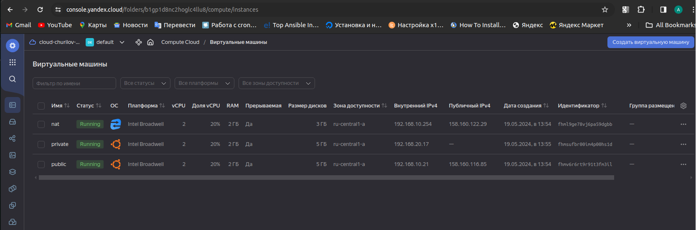
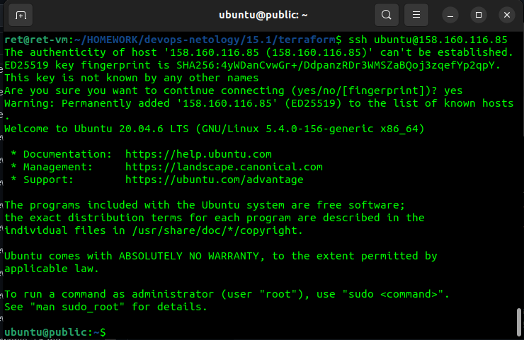
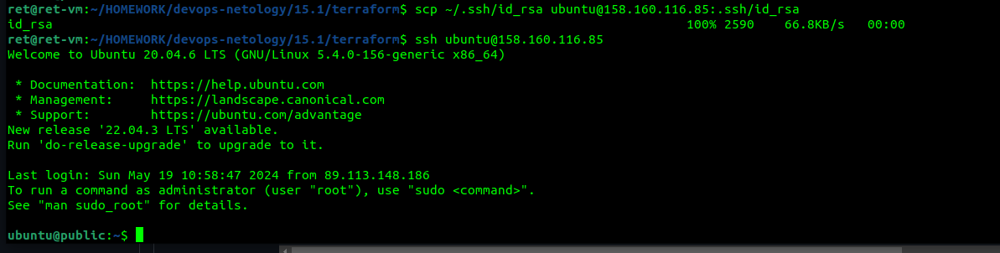
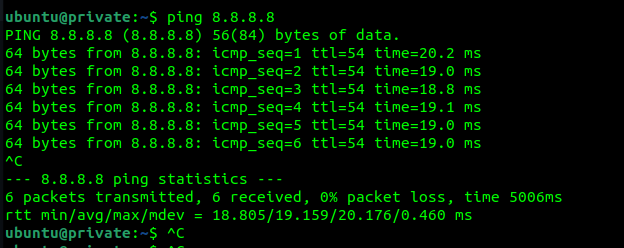

# Домашнее задание к занятию «Организация сети»

### Подготовка к выполнению задания

1. Домашнее задание состоит из обязательной части, которую нужно выполнить на провайдере Yandex Cloud, и дополнительной части в AWS (выполняется по желанию). 
2. Все домашние задания в блоке 15 связаны друг с другом и в конце представляют пример законченной инфраструктуры.  
3. Все задания нужно выполнить с помощью Terraform. Результатом выполненного домашнего задания будет код в репозитории. 
4. Перед началом работы настройте доступ к облачным ресурсам из Terraform, используя материалы прошлых лекций и домашнее задание по теме «Облачные провайдеры и синтаксис Terraform». Заранее выберите регион (в случае AWS) и зону.

---
### Задание 1. Yandex Cloud 

**Что нужно сделать**

1. Создать пустую VPC. Выбрать зону.
2. Публичная подсеть.

 - Создать в VPC subnet с названием public, сетью 192.168.10.0/24.
 - Создать в этой подсети NAT-инстанс, присвоив ему адрес 192.168.10.254. В качестве image_id использовать fd80mrhj8fl2oe87o4e1.
 - Создать в этой публичной подсети виртуалку с публичным IP, подключиться к ней и убедиться, что есть доступ к интернету.
3. Приватная подсеть.
 - Создать в VPC subnet с названием private, сетью 192.168.20.0/24.
 - Создать route table. Добавить статический маршрут, направляющий весь исходящий трафик private сети в NAT-инстанс.
 - Создать в этой приватной подсети виртуалку с внутренним IP, подключиться к ней через виртуалку, созданную ранее, и убедиться, что есть доступ к интернету.

Resource Terraform для Yandex Cloud:

- [VPC subnet](https://registry.terraform.io/providers/yandex-cloud/yandex/latest/docs/resources/vpc_subnet).
- [Route table](https://registry.terraform.io/providers/yandex-cloud/yandex/latest/docs/resources/vpc_route_table).
- [Compute Instance](https://registry.terraform.io/providers/yandex-cloud/yandex/latest/docs/resources/compute_instance).


### Ответ

[Конфиги Terraform](https://github.com/ChuckBartowski13/devops-netology/tree/main/15.1/terraform)






```
logout
Connection to 192.168.20.17 closed.
ubuntu@public:~$ exit
logout
Connection to 158.160.116.85 closed.
ret@ret-vm:~/HOMEWORK/devops-netology/15.1/terraform$ terraform destroy
data.yandex_compute_image.nat-ubuntu: Reading...
data.yandex_compute_image.private-ubuntu: Reading...
data.yandex_compute_image.public-ubuntu: Reading...
yandex_vpc_network.netology-network: Refreshing state... [id=enp3kg3e2n45hdcecc46]
data.yandex_compute_image.nat-ubuntu: Read complete after 1s [id=fd80mrhj8fl2oe87o4e1]
data.yandex_compute_image.public-ubuntu: Read complete after 1s [id=fd8pqclrbi85ektgehlf]
data.yandex_compute_image.private-ubuntu: Read complete after 1s [id=fd8pqclrbi85ektgehlf]
yandex_vpc_subnet.public: Refreshing state... [id=e9bhqv2dqiv098caqgt7]
yandex_compute_instance.public-instance: Refreshing state... [id=fhmv6r6rt9r91t3fm3il]
yandex_compute_instance.nat-instance: Refreshing state... [id=fhml9ge78vj6pa59dgbb]
yandex_vpc_route_table.private-netology: Refreshing state... [id=enp0cihpaqbcef1gon30]
yandex_vpc_subnet.private: Refreshing state... [id=e9bae5tg295bvb6nppk0]
yandex_compute_instance.private-instance: Refreshing state... [id=fhmsufbr00im4p00hs1d]

Terraform used the selected providers to generate the following execution plan. Resource actions are indicated with the following symbols:
  - destroy

Terraform will perform the following actions:

  # yandex_compute_instance.nat-instance will be destroyed
  - resource "yandex_compute_instance" "nat-instance" {
      - created_at                = "2024-05-19T10:54:31Z" -> null
      - folder_id                 = "b1gp1d8nc2hoglc4llu8" -> null
      - fqdn                      = "nat.ru-central1.internal" -> null
      - hostname                  = "nat" -> null
      - id                        = "fhml9ge78vj6pa59dgbb" -> null
      - labels                    = {} -> null
      - metadata                  = {
          - "ssh-keys" = <<-EOT
                ubuntu:ssh-rsa AAAAB3NzaC1yc2EAAAADAQABAAABgQC9FPxk1VMFbMs1g/SnRP6mICbLivvg5SYloWJlzeqKhIKXSuQY7U1AtEfRYLKDZbnf98WndodBS74pRaceawXqmYHcDeHCwdRCGOeYMbOZO7DlgR0wOrYTLqb0HVQwwr1J5ZNvmvRat9o34DUtOGlC++zgZdwiU1FGe47gVTq2I6vylosHUCoW4hOWWc0pDDpjVF6VvSrxF2QvwVi8GVV9GvPKeXe5GCtFYS+U8TEgScZRhDFgeIzgFn5BMgMeDJsNSEJ4on08vM9FFpbq4Og/foqUnWFV7nEO33CTqx2dXJMm/Gdg+ZXl4Z4+FRmaN4gNrPQKMtQTfGkdlP3iL71/ZDYyLTohTJn4fnpESEy1tw3QDhS20T+tMLkwIrLOSaYhlPMUTY/m3ZyB8+z5ZBNab3rUiTP78lXUI+GL7+lxzqGzgW5MJH4IYQirumpMS9LUmCKlnY2lYpTsoSz+k7SV3OaNo6rk2mKza/+6bRwE20lbnLETd88vqo15czinfjU= ret@ret-vm
            EOT
        } -> null
      - name                      = "nat" -> null
      - network_acceleration_type = "standard" -> null
      - platform_id               = "standard-v1" -> null
      - status                    = "running" -> null
      - zone                      = "ru-central1-a" -> null
        # (4 unchanged attributes hidden)

      - boot_disk {
          - auto_delete = true -> null
          - device_name = "fhm60iq7v0ae19t48ct9" -> null
          - disk_id     = "fhm60iq7v0ae19t48ct9" -> null
          - mode        = "READ_WRITE" -> null

          - initialize_params {
              - block_size  = 4096 -> null
              - image_id    = "fd80mrhj8fl2oe87o4e1" -> null
                name        = null
              - size        = 3 -> null
              - type        = "network-hdd" -> null
                # (2 unchanged attributes hidden)
            }
        }

      - metadata_options {
          - aws_v1_http_endpoint = 1 -> null
          - aws_v1_http_token    = 2 -> null
          - gce_http_endpoint    = 1 -> null
          - gce_http_token       = 1 -> null
        }

      - network_interface {
          - index              = 0 -> null
          - ip_address         = "192.168.10.254" -> null
          - ipv4               = true -> null
          - ipv6               = false -> null
          - mac_address        = "d0:0d:15:4c:1c:74" -> null
          - nat                = true -> null
          - nat_ip_address     = "158.160.122.29" -> null
          - nat_ip_version     = "IPV4" -> null
          - security_group_ids = [] -> null
          - subnet_id          = "e9bhqv2dqiv098caqgt7" -> null
            # (1 unchanged attribute hidden)
        }

      - placement_policy {
          - host_affinity_rules       = [] -> null
          - placement_group_partition = 0 -> null
            # (1 unchanged attribute hidden)
        }

      - resources {
          - core_fraction = 20 -> null
          - cores         = 2 -> null
          - gpus          = 0 -> null
          - memory        = 2 -> null
        }

      - scheduling_policy {
          - preemptible = true -> null
        }
    }

  # yandex_compute_instance.private-instance will be destroyed
  - resource "yandex_compute_instance" "private-instance" {
      - created_at                = "2024-05-19T10:55:37Z" -> null
      - folder_id                 = "b1gp1d8nc2hoglc4llu8" -> null
      - fqdn                      = "private.ru-central1.internal" -> null
      - hostname                  = "private" -> null
      - id                        = "fhmsufbr00im4p00hs1d" -> null
      - labels                    = {} -> null
      - metadata                  = {
          - "ssh-keys" = <<-EOT
                ubuntu:ssh-rsa AAAAB3NzaC1yc2EAAAADAQABAAABgQC9FPxk1VMFbMs1g/SnRP6mICbLivvg5SYloWJlzeqKhIKXSuQY7U1AtEfRYLKDZbnf98WndodBS74pRaceawXqmYHcDeHCwdRCGOeYMbOZO7DlgR0wOrYTLqb0HVQwwr1J5ZNvmvRat9o34DUtOGlC++zgZdwiU1FGe47gVTq2I6vylosHUCoW4hOWWc0pDDpjVF6VvSrxF2QvwVi8GVV9GvPKeXe5GCtFYS+U8TEgScZRhDFgeIzgFn5BMgMeDJsNSEJ4on08vM9FFpbq4Og/foqUnWFV7nEO33CTqx2dXJMm/Gdg+ZXl4Z4+FRmaN4gNrPQKMtQTfGkdlP3iL71/ZDYyLTohTJn4fnpESEy1tw3QDhS20T+tMLkwIrLOSaYhlPMUTY/m3ZyB8+z5ZBNab3rUiTP78lXUI+GL7+lxzqGzgW5MJH4IYQirumpMS9LUmCKlnY2lYpTsoSz+k7SV3OaNo6rk2mKza/+6bRwE20lbnLETd88vqo15czinfjU= ret@ret-vm
            EOT
        } -> null
      - name                      = "private" -> null
      - network_acceleration_type = "standard" -> null
      - platform_id               = "standard-v1" -> null
      - status                    = "running" -> null
      - zone                      = "ru-central1-a" -> null
        # (4 unchanged attributes hidden)

      - boot_disk {
          - auto_delete = true -> null
          - device_name = "fhme0mo2sc72te037kdu" -> null
          - disk_id     = "fhme0mo2sc72te037kdu" -> null
          - mode        = "READ_WRITE" -> null

          - initialize_params {
              - block_size  = 4096 -> null
              - image_id    = "fd8pqclrbi85ektgehlf" -> null
                name        = null
              - size        = 5 -> null
              - type        = "network-hdd" -> null
                # (2 unchanged attributes hidden)
            }
        }

      - metadata_options {
          - aws_v1_http_endpoint = 1 -> null
          - aws_v1_http_token    = 2 -> null
          - gce_http_endpoint    = 1 -> null
          - gce_http_token       = 1 -> null
        }

      - network_interface {
          - index              = 0 -> null
          - ip_address         = "192.168.20.17" -> null
          - ipv4               = true -> null
          - ipv6               = false -> null
          - mac_address        = "d0:0d:1c:f3:d7:b0" -> null
          - nat                = false -> null
          - security_group_ids = [] -> null
          - subnet_id          = "e9bae5tg295bvb6nppk0" -> null
            # (3 unchanged attributes hidden)
        }

      - placement_policy {
          - host_affinity_rules       = [] -> null
          - placement_group_partition = 0 -> null
            # (1 unchanged attribute hidden)
        }

      - resources {
          - core_fraction = 20 -> null
          - cores         = 2 -> null
          - gpus          = 0 -> null
          - memory        = 2 -> null
        }

      - scheduling_policy {
          - preemptible = true -> null
        }
    }

  # yandex_compute_instance.public-instance will be destroyed
  - resource "yandex_compute_instance" "public-instance" {
      - created_at                = "2024-05-19T10:54:31Z" -> null
      - folder_id                 = "b1gp1d8nc2hoglc4llu8" -> null
      - fqdn                      = "public.ru-central1.internal" -> null
      - hostname                  = "public" -> null
      - id                        = "fhmv6r6rt9r91t3fm3il" -> null
      - labels                    = {} -> null
      - metadata                  = {
          - "ssh-keys" = <<-EOT
                ubuntu:ssh-rsa AAAAB3NzaC1yc2EAAAADAQABAAABgQC9FPxk1VMFbMs1g/SnRP6mICbLivvg5SYloWJlzeqKhIKXSuQY7U1AtEfRYLKDZbnf98WndodBS74pRaceawXqmYHcDeHCwdRCGOeYMbOZO7DlgR0wOrYTLqb0HVQwwr1J5ZNvmvRat9o34DUtOGlC++zgZdwiU1FGe47gVTq2I6vylosHUCoW4hOWWc0pDDpjVF6VvSrxF2QvwVi8GVV9GvPKeXe5GCtFYS+U8TEgScZRhDFgeIzgFn5BMgMeDJsNSEJ4on08vM9FFpbq4Og/foqUnWFV7nEO33CTqx2dXJMm/Gdg+ZXl4Z4+FRmaN4gNrPQKMtQTfGkdlP3iL71/ZDYyLTohTJn4fnpESEy1tw3QDhS20T+tMLkwIrLOSaYhlPMUTY/m3ZyB8+z5ZBNab3rUiTP78lXUI+GL7+lxzqGzgW5MJH4IYQirumpMS9LUmCKlnY2lYpTsoSz+k7SV3OaNo6rk2mKza/+6bRwE20lbnLETd88vqo15czinfjU= ret@ret-vm
            EOT
        } -> null
      - name                      = "public" -> null
      - network_acceleration_type = "standard" -> null
      - platform_id               = "standard-v1" -> null
      - status                    = "running" -> null
      - zone                      = "ru-central1-a" -> null
        # (4 unchanged attributes hidden)

      - boot_disk {
          - auto_delete = true -> null
          - device_name = "fhmp6sarcg4gr8suc54f" -> null
          - disk_id     = "fhmp6sarcg4gr8suc54f" -> null
          - mode        = "READ_WRITE" -> null

          - initialize_params {
              - block_size  = 4096 -> null
              - image_id    = "fd8pqclrbi85ektgehlf" -> null
                name        = null
              - size        = 5 -> null
              - type        = "network-hdd" -> null
                # (2 unchanged attributes hidden)
            }
        }

      - metadata_options {
          - aws_v1_http_endpoint = 1 -> null
          - aws_v1_http_token    = 2 -> null
          - gce_http_endpoint    = 1 -> null
          - gce_http_token       = 1 -> null
        }

      - network_interface {
          - index              = 0 -> null
          - ip_address         = "192.168.10.21" -> null
          - ipv4               = true -> null
          - ipv6               = false -> null
          - mac_address        = "d0:0d:1f:36:cd:be" -> null
          - nat                = true -> null
          - nat_ip_address     = "158.160.116.85" -> null
          - nat_ip_version     = "IPV4" -> null
          - security_group_ids = [] -> null
          - subnet_id          = "e9bhqv2dqiv098caqgt7" -> null
            # (1 unchanged attribute hidden)
        }

      - placement_policy {
          - host_affinity_rules       = [] -> null
          - placement_group_partition = 0 -> null
            # (1 unchanged attribute hidden)
        }

      - resources {
          - core_fraction = 20 -> null
          - cores         = 2 -> null
          - gpus          = 0 -> null
          - memory        = 2 -> null
        }

      - scheduling_policy {
          - preemptible = true -> null
        }
    }

  # yandex_vpc_network.netology-network will be destroyed
  - resource "yandex_vpc_network" "netology-network" {
      - created_at                = "2024-05-19T10:54:28Z" -> null
      - default_security_group_id = "enpqqf66k91udbk4mnqs" -> null
      - folder_id                 = "b1gp1d8nc2hoglc4llu8" -> null
      - id                        = "enp3kg3e2n45hdcecc46" -> null
      - labels                    = {} -> null
      - name                      = "develop" -> null
      - subnet_ids                = [
          - "e9bae5tg295bvb6nppk0",
          - "e9bhqv2dqiv098caqgt7",
        ] -> null
        # (1 unchanged attribute hidden)
    }

  # yandex_vpc_route_table.private-netology will be destroyed
  - resource "yandex_vpc_route_table" "private-netology" {
      - created_at  = "2024-05-19T10:55:36Z" -> null
      - folder_id   = "b1gp1d8nc2hoglc4llu8" -> null
      - id          = "enp0cihpaqbcef1gon30" -> null
      - labels      = {} -> null
      - name        = "private-netology" -> null
      - network_id  = "enp3kg3e2n45hdcecc46" -> null
        # (1 unchanged attribute hidden)

      - static_route {
          - destination_prefix = "0.0.0.0/0" -> null
          - next_hop_address   = "192.168.10.254" -> null
            # (1 unchanged attribute hidden)
        }
    }

  # yandex_vpc_subnet.private will be destroyed
  - resource "yandex_vpc_subnet" "private" {
      - created_at     = "2024-05-19T10:55:37Z" -> null
      - folder_id      = "b1gp1d8nc2hoglc4llu8" -> null
      - id             = "e9bae5tg295bvb6nppk0" -> null
      - labels         = {} -> null
      - name           = "private-subnet" -> null
      - network_id     = "enp3kg3e2n45hdcecc46" -> null
      - route_table_id = "enp0cihpaqbcef1gon30" -> null
      - v4_cidr_blocks = [
          - "192.168.20.0/24",
        ] -> null
      - v6_cidr_blocks = [] -> null
      - zone           = "ru-central1-a" -> null
        # (1 unchanged attribute hidden)
    }

  # yandex_vpc_subnet.public will be destroyed
  - resource "yandex_vpc_subnet" "public" {
      - created_at     = "2024-05-19T10:54:30Z" -> null
      - folder_id      = "b1gp1d8nc2hoglc4llu8" -> null
      - id             = "e9bhqv2dqiv098caqgt7" -> null
      - labels         = {} -> null
      - name           = "public-subnet" -> null
      - network_id     = "enp3kg3e2n45hdcecc46" -> null
      - v4_cidr_blocks = [
          - "192.168.10.0/24",
        ] -> null
      - v6_cidr_blocks = [] -> null
      - zone           = "ru-central1-a" -> null
        # (2 unchanged attributes hidden)
    }

Plan: 0 to add, 0 to change, 7 to destroy.

Changes to Outputs:
  - vm_external_ip_address_nat     = "192.168.10.254" -> null
  - vm_external_ip_address_private = "192.168.20.17" -> null
  - vm_external_ip_address_public  = "192.168.10.21" -> null

Do you really want to destroy all resources?
  Terraform will destroy all your managed infrastructure, as shown above.
  There is no undo. Only 'yes' will be accepted to confirm.

  Enter a value: yes

yandex_compute_instance.public-instance: Destroying... [id=fhmv6r6rt9r91t3fm3il]
yandex_compute_instance.private-instance: Destroying... [id=fhmsufbr00im4p00hs1d]
yandex_compute_instance.private-instance: Still destroying... [id=fhmsufbr00im4p00hs1d, 10s elapsed]
yandex_compute_instance.public-instance: Still destroying... [id=fhmv6r6rt9r91t3fm3il, 10s elapsed]
yandex_compute_instance.public-instance: Still destroying... [id=fhmv6r6rt9r91t3fm3il, 20s elapsed]
yandex_compute_instance.private-instance: Still destroying... [id=fhmsufbr00im4p00hs1d, 20s elapsed]
yandex_compute_instance.public-instance: Still destroying... [id=fhmv6r6rt9r91t3fm3il, 30s elapsed]
yandex_compute_instance.private-instance: Still destroying... [id=fhmsufbr00im4p00hs1d, 30s elapsed]
yandex_compute_instance.public-instance: Still destroying... [id=fhmv6r6rt9r91t3fm3il, 40s elapsed]
yandex_compute_instance.private-instance: Still destroying... [id=fhmsufbr00im4p00hs1d, 40s elapsed]
yandex_compute_instance.private-instance: Destruction complete after 42s
yandex_vpc_subnet.private: Destroying... [id=e9bae5tg295bvb6nppk0]
yandex_compute_instance.public-instance: Destruction complete after 44s
yandex_vpc_subnet.private: Destruction complete after 3s
yandex_vpc_route_table.private-netology: Destroying... [id=enp0cihpaqbcef1gon30]
yandex_vpc_route_table.private-netology: Destruction complete after 1s
yandex_compute_instance.nat-instance: Destroying... [id=fhml9ge78vj6pa59dgbb]
yandex_compute_instance.nat-instance: Still destroying... [id=fhml9ge78vj6pa59dgbb, 10s elapsed]
yandex_compute_instance.nat-instance: Still destroying... [id=fhml9ge78vj6pa59dgbb, 20s elapsed]
yandex_compute_instance.nat-instance: Still destroying... [id=fhml9ge78vj6pa59dgbb, 30s elapsed]
yandex_compute_instance.nat-instance: Still destroying... [id=fhml9ge78vj6pa59dgbb, 40s elapsed]
yandex_compute_instance.nat-instance: Destruction complete after 44s
yandex_vpc_subnet.public: Destroying... [id=e9bhqv2dqiv098caqgt7]
yandex_vpc_subnet.public: Destruction complete after 3s
yandex_vpc_network.netology-network: Destroying... [id=enp3kg3e2n45hdcecc46]
yandex_vpc_network.netology-network: Destruction complete after 0s

Destroy complete! Resources: 7 destroyed.

```
