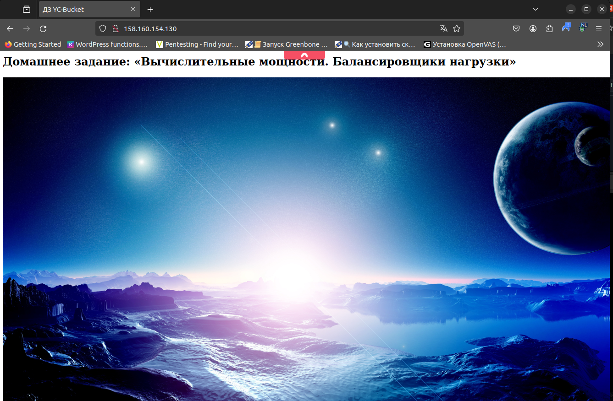
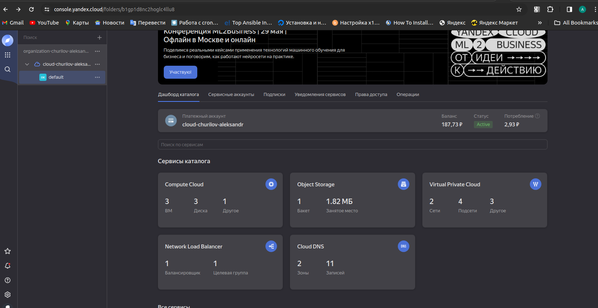
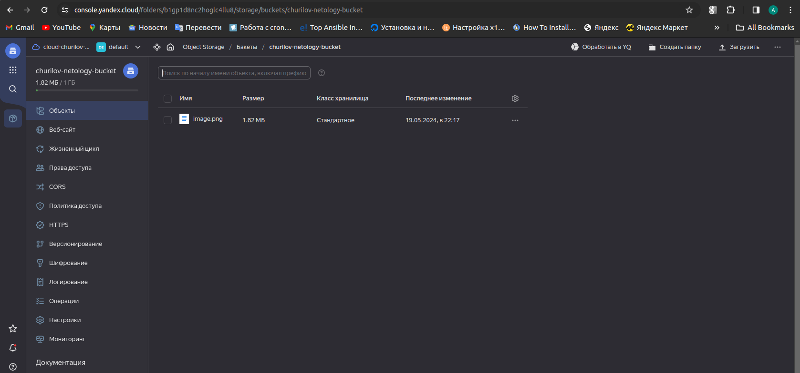
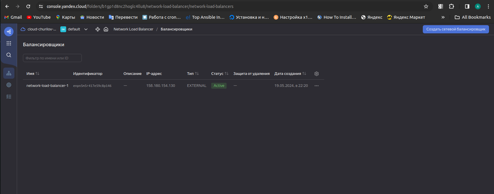
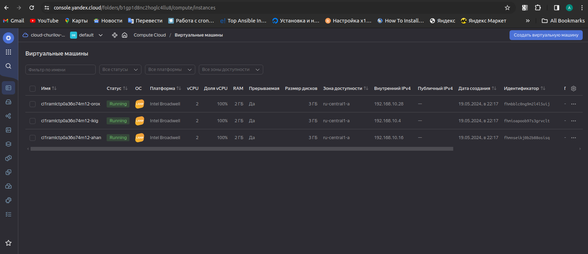
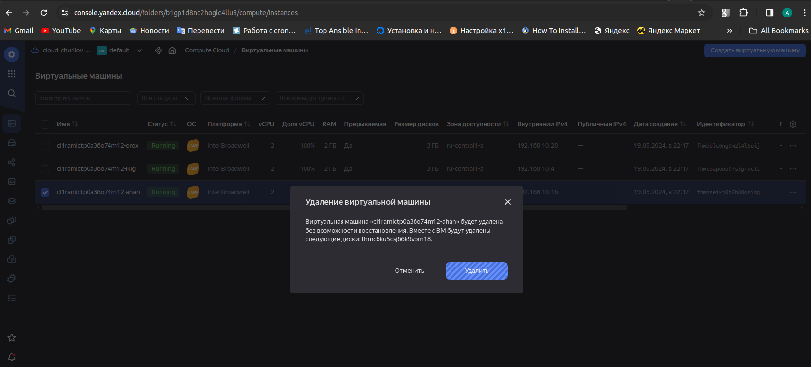
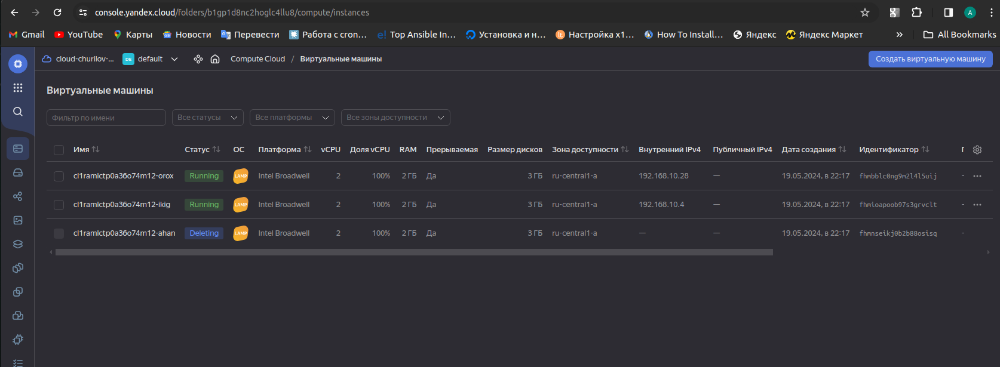
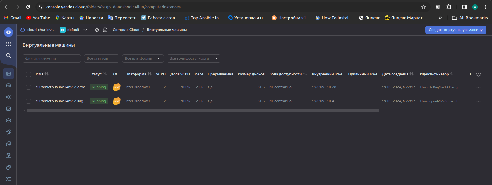
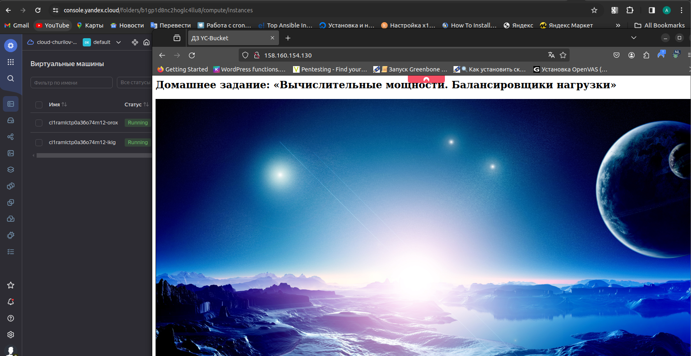

# Домашнее задание к занятию «Вычислительные мощности. Балансировщики нагрузки»  

### Подготовка к выполнению задания

1. Домашнее задание состоит из обязательной части, которую нужно выполнить на провайдере Yandex Cloud, и дополнительной части в AWS (выполняется по желанию). 
2. Все домашние задания в блоке 15 связаны друг с другом и в конце представляют пример законченной инфраструктуры.  
3. Все задания нужно выполнить с помощью Terraform. Результатом выполненного домашнего задания будет код в репозитории. 
4. Перед началом работы настройте доступ к облачным ресурсам из Terraform, используя материалы прошлых лекций и домашних заданий.

---
## Задание 1. Yandex Cloud 

**Что нужно сделать**

1. Создать бакет Object Storage и разместить в нём файл с картинкой:

 - Создать бакет в Object Storage с произвольным именем (например, _имя_студента_дата_).
 - Положить в бакет файл с картинкой.
 - Сделать файл доступным из интернета.
 
2. Создать группу ВМ в public подсети фиксированного размера с шаблоном LAMP и веб-страницей, содержащей ссылку на картинку из бакета:

 - Создать Instance Group с тремя ВМ и шаблоном LAMP. Для LAMP рекомендуется использовать `image_id = fd827b91d99psvq5fjit`.
 - Для создания стартовой веб-страницы рекомендуется использовать раздел `user_data` в [meta_data](https://cloud.yandex.ru/docs/compute/concepts/vm-metadata).
 - Разместить в стартовой веб-странице шаблонной ВМ ссылку на картинку из бакета.
 - Настроить проверку состояния ВМ.
 
3. Подключить группу к сетевому балансировщику:

 - Создать сетевой балансировщик.
 - Проверить работоспособность, удалив одну или несколько ВМ.
4. (дополнительно)* Создать Application Load Balancer с использованием Instance group и проверкой состояния.

Полезные документы:

- [Compute instance group](https://registry.terraform.io/providers/yandex-cloud/yandex/latest/docs/resources/compute_instance_group).
- [Network Load Balancer](https://registry.terraform.io/providers/yandex-cloud/yandex/latest/docs/resources/lb_network_load_balancer).
- [Группа ВМ с сетевым балансировщиком](https://cloud.yandex.ru/docs/compute/operations/instance-groups/create-with-balancer).

---

### Ответ:
```
ret@ret-vm:~/HOMEWORK/devops-netology/15.2/terraform$ terraform plan
yandex_vpc_network.netology-net: Refreshing state... [id=enpbog96138a1klnb2li]
yandex_iam_service_account.bucket-sa: Refreshing state... [id=aje38ak9oulbot1fho08]
yandex_iam_service_account.sof-ra: Refreshing state... [id=ajeu4r390vgfh5vd9mn1]
yandex_vpc_subnet.public: Refreshing state... [id=e9bj2c0nuf8fdpjg16r5]
yandex_iam_service_account_static_access_key.sa-static-key: Refreshing state... [id=ajejfs21u8k5v4t3gjr6]
yandex_storage_bucket.vp-bucket: Refreshing state... [id=churilov-netology-bucket]
yandex_storage_object.my-picture: Refreshing state... [id=image.png]
yandex_compute_instance_group.vp-nlb-ig: Refreshing state... [id=cl1m9el9eqq64gj8s9ag]

Note: Objects have changed outside of Terraform

Terraform detected the following changes made outside of Terraform since the last "terraform apply" which may have affected this plan:

  # yandex_compute_instance_group.vp-nlb-ig has been deleted
  - resource "yandex_compute_instance_group" "vp-nlb-ig" {
        id                           = "cl1m9el9eqq64gj8s9ag"
        name                         = "vp-nlb-ig"
        # (10 unchanged attributes hidden)

      - load_balancer {
          - target_group_id              = "enpfjb56t5fddoqch23h" -> null
            # (6 unchanged attributes hidden)
        }

        # (5 unchanged blocks hidden)
    }

  # yandex_storage_bucket.vp-bucket has been deleted
  - resource "yandex_storage_bucket" "vp-bucket" {
      - bucket_domain_name    = "churilov-netology-bucket.storage.yandexcloud.net" -> null
      - id                    = "churilov-netology-bucket" -> null
        tags                  = {}
        # (8 unchanged attributes hidden)

        # (2 unchanged blocks hidden)
    }

  # yandex_storage_object.my-picture has been deleted
  - resource "yandex_storage_object" "my-picture" {
        id           = "image.png"
      - key          = "image.png" -> null
        tags         = {}
        # (6 unchanged attributes hidden)
    }

  # yandex_vpc_network.netology-net has been deleted
  - resource "yandex_vpc_network" "netology-net" {
      - id                        = "enpbog96138a1klnb2li" -> null
        name                      = "netology-net"
        # (6 unchanged attributes hidden)
    }

  # yandex_vpc_subnet.public has been deleted
  - resource "yandex_vpc_subnet" "public" {
      - id             = "e9bj2c0nuf8fdpjg16r5" -> null
        name           = "public"
        # (9 unchanged attributes hidden)
    }


Unless you have made equivalent changes to your configuration, or ignored the relevant attributes using ignore_changes, the following plan
may include actions to undo or respond to these changes.

──────────────────────────────────────────────────────────────────────────────────────────────────────────────────────────────────────────

Terraform used the selected providers to generate the following execution plan. Resource actions are indicated with the following symbols:
  + create
  - destroy

Terraform will perform the following actions:

  # yandex_compute_instance_group.vp-nlb-ig will be created
  + resource "yandex_compute_instance_group" "vp-nlb-ig" {
      + created_at          = (known after apply)
      + deletion_protection = false
      + folder_id           = "b1gp1d8nc2hoglc4llu8"
      + id                  = (known after apply)
      + instances           = (known after apply)
      + name                = "vp-nlb-ig"
      + service_account_id  = (known after apply)
      + status              = (known after apply)

      + allocation_policy {
          + zones = [
              + "ru-central1-a",
            ]
        }

      + deploy_policy {
          + max_creating     = 0
          + max_deleting     = 0
          + max_expansion    = 1
          + max_unavailable  = 2
          + startup_duration = 0
          + strategy         = (known after apply)
        }

      + health_check {
          + healthy_threshold   = 5
          + interval            = 2
          + timeout             = 1
          + unhealthy_threshold = 2

          + http_options {
              + path = "/"
              + port = 80
            }
        }

      + instance_template {
          + labels      = {
              + "group" = "network-load-balanced"
            }
          + metadata    = (known after apply)
          + platform_id = "standard-v1"

          + boot_disk {
              + device_name = (known after apply)
              + mode        = "READ_WRITE"

              + initialize_params {
                  + image_id    = "fd827b91d99psvq5fjit"
                  + size        = (known after apply)
                  + snapshot_id = (known after apply)
                  + type        = "network-hdd"
                }
            }

          + network_interface {
              + ip_address   = (known after apply)
              + ipv4         = true
              + ipv6         = (known after apply)
              + ipv6_address = (known after apply)
              + nat          = (known after apply)
              + network_id   = (known after apply)
              + subnet_ids   = (known after apply)
            }

          + resources {
              + core_fraction = 100
              + cores         = 2
              + memory        = 2
            }

          + scheduling_policy {
              + preemptible = true
            }
        }

      + load_balancer {
          + status_message           = (known after apply)
          + target_group_description = "Target group for network balancer"
          + target_group_id          = (known after apply)
          + target_group_name        = "vp-target-nlb-group"
        }

      + scale_policy {
          + fixed_scale {
              + size = 3
            }
        }
    }

  # yandex_iam_service_account.chu-ra will be created
  + resource "yandex_iam_service_account" "chu-ra" {
      + created_at  = (known after apply)
      + description = "Service account for managing VM group"
      + folder_id   = (known after apply)
      + id          = (known after apply)
      + name        = "chu-ra"
    }

  # yandex_iam_service_account.sof-ra will be destroyed
  # (because yandex_iam_service_account.sof-ra is not in configuration)
  - resource "yandex_iam_service_account" "sof-ra" {
      - created_at  = "2024-05-19T11:51:45Z" -> null
      - description = "Service account for managing VM group" -> null
      - folder_id   = "b1gp1d8nc2hoglc4llu8" -> null
      - id          = "ajeu4r390vgfh5vd9mn1" -> null
      - name        = "sof-ra" -> null
    }

  # yandex_lb_network_load_balancer.vp-nlb-1 will be created
  + resource "yandex_lb_network_load_balancer" "vp-nlb-1" {
      + created_at          = (known after apply)
      + deletion_protection = (known after apply)
      + folder_id           = (known after apply)
      + id                  = (known after apply)
      + name                = "network-load-balancer-1"
      + region_id           = (known after apply)
      + type                = "external"

      + attached_target_group {
          + target_group_id = (known after apply)

          + healthcheck {
              + healthy_threshold   = 5
              + interval            = 2
              + name                = "http"
              + timeout             = 1
              + unhealthy_threshold = 2

              + http_options {
                  + path = "/"
                  + port = 80
                }
            }
        }

      + listener {
          + name        = "network-load-balancer-1-listener"
          + port        = 80
          + protocol    = (known after apply)
          + target_port = (known after apply)

          + external_address_spec {
              + address    = (known after apply)
              + ip_version = "ipv4"
            }
        }
    }

  # yandex_resourcemanager_folder_iam_member.editor will be created
  + resource "yandex_resourcemanager_folder_iam_member" "editor" {
      + folder_id = "b1gp1d8nc2hoglc4llu8"
      + id        = (known after apply)
      + member    = (known after apply)
      + role      = "editor"
    }

  # yandex_resourcemanager_folder_iam_member.sa-editor will be created
  + resource "yandex_resourcemanager_folder_iam_member" "sa-editor" {
      + folder_id = "b1gp1d8nc2hoglc4llu8"
      + id        = (known after apply)
      + member    = "serviceAccount:aje38ak9oulbot1fho08"
      + role      = "storage.editor"
    }

  # yandex_storage_bucket.vp-bucket will be created
  + resource "yandex_storage_bucket" "vp-bucket" {
      + access_key            = "YCAJElRBlq1VFujxDgDP97dGI"
      + bucket                = "churilov-netology-bucket"
      + bucket_domain_name    = (known after apply)
      + default_storage_class = (known after apply)
      + folder_id             = (known after apply)
      + force_destroy         = false
      + id                    = (known after apply)
      + max_size              = 1073741824
      + secret_key            = (sensitive value)
      + website_domain        = (known after apply)
      + website_endpoint      = (known after apply)

      + anonymous_access_flags {
          + list = false
          + read = true
        }
    }

  # yandex_storage_object.my-picture will be created
  + resource "yandex_storage_object" "my-picture" {
      + access_key   = "YCAJElRBlq1VFujxDgDP97dGI"
      + acl          = "private"
      + bucket       = (known after apply)
      + content_type = (known after apply)
      + id           = (known after apply)
      + key          = "image.png"
      + secret_key   = (sensitive value)
      + source       = "image.png"
    }

  # yandex_vpc_network.netology-net will be created
  + resource "yandex_vpc_network" "netology-net" {
      + created_at                = (known after apply)
      + default_security_group_id = (known after apply)
      + folder_id                 = (known after apply)
      + id                        = (known after apply)
      + labels                    = (known after apply)
      + name                      = "netology-net"
      + subnet_ids                = (known after apply)
    }

  # yandex_vpc_subnet.public will be created
  + resource "yandex_vpc_subnet" "public" {
      + created_at     = (known after apply)
      + folder_id      = (known after apply)
      + id             = (known after apply)
      + labels         = (known after apply)
      + name           = "public"
      + network_id     = (known after apply)
      + v4_cidr_blocks = [
          + "192.168.10.0/24",
        ]
      + v6_cidr_blocks = (known after apply)
      + zone           = "ru-central1-a"
    }

Plan: 9 to add, 0 to change, 1 to destroy.

Changes to Outputs:
  + nlb-address = [
      + (known after apply),
    ]
  + pic-url     = (known after apply)

──────────────────────────────────────────────────────────────────────────────────────────────────────────────────────────────────────────

Note: You didn't use the -out option to save this plan, so Terraform can't guarantee to take exactly these actions if you run "terraform
apply" now.
ret@ret-vm:~/HOMEWORK/devops-netology/15.2/terraform$ terraform apply
yandex_iam_service_account.sof-ra: Refreshing state... [id=ajeu4r390vgfh5vd9mn1]
yandex_vpc_network.netology-net: Refreshing state... [id=enpbog96138a1klnb2li]
yandex_iam_service_account.bucket-sa: Refreshing state... [id=aje38ak9oulbot1fho08]
yandex_iam_service_account_static_access_key.sa-static-key: Refreshing state... [id=ajejfs21u8k5v4t3gjr6]
yandex_vpc_subnet.public: Refreshing state... [id=e9bj2c0nuf8fdpjg16r5]
yandex_storage_bucket.vp-bucket: Refreshing state... [id=churilov-netology-bucket]
yandex_storage_object.my-picture: Refreshing state... [id=image.png]
yandex_compute_instance_group.vp-nlb-ig: Refreshing state... [id=cl1m9el9eqq64gj8s9ag]

Note: Objects have changed outside of Terraform

Terraform detected the following changes made outside of Terraform since the last "terraform apply" which may have affected this plan:

  # yandex_compute_instance_group.vp-nlb-ig has been deleted
  - resource "yandex_compute_instance_group" "vp-nlb-ig" {
        id                           = "cl1m9el9eqq64gj8s9ag"
        name                         = "vp-nlb-ig"
        # (10 unchanged attributes hidden)

      - load_balancer {
          - target_group_id              = "enpfjb56t5fddoqch23h" -> null
            # (6 unchanged attributes hidden)
        }

        # (5 unchanged blocks hidden)
    }

  # yandex_storage_bucket.vp-bucket has been deleted
  - resource "yandex_storage_bucket" "vp-bucket" {
      - bucket_domain_name    = "churilov-netology-bucket.storage.yandexcloud.net" -> null
      - id                    = "churilov-netology-bucket" -> null
        tags                  = {}
        # (8 unchanged attributes hidden)

        # (2 unchanged blocks hidden)
    }

  # yandex_storage_object.my-picture has been deleted
  - resource "yandex_storage_object" "my-picture" {
        id           = "image.png"
      - key          = "image.png" -> null
        tags         = {}
        # (6 unchanged attributes hidden)
    }

  # yandex_vpc_network.netology-net has been deleted
  - resource "yandex_vpc_network" "netology-net" {
      - id                        = "enpbog96138a1klnb2li" -> null
        name                      = "netology-net"
        # (6 unchanged attributes hidden)
    }

  # yandex_vpc_subnet.public has been deleted
  - resource "yandex_vpc_subnet" "public" {
      - id             = "e9bj2c0nuf8fdpjg16r5" -> null
        name           = "public"
        # (9 unchanged attributes hidden)
    }


Unless you have made equivalent changes to your configuration, or ignored the relevant attributes using ignore_changes, the following plan
may include actions to undo or respond to these changes.

──────────────────────────────────────────────────────────────────────────────────────────────────────────────────────────────────────────

Terraform used the selected providers to generate the following execution plan. Resource actions are indicated with the following symbols:
  + create
  - destroy

Terraform will perform the following actions:

  # yandex_compute_instance_group.vp-nlb-ig will be created
  + resource "yandex_compute_instance_group" "vp-nlb-ig" {
      + created_at          = (known after apply)
      + deletion_protection = false
      + folder_id           = "b1gp1d8nc2hoglc4llu8"
      + id                  = (known after apply)
      + instances           = (known after apply)
      + name                = "vp-nlb-ig"
      + service_account_id  = (known after apply)
      + status              = (known after apply)

      + allocation_policy {
          + zones = [
              + "ru-central1-a",
            ]
        }

      + deploy_policy {
          + max_creating     = 0
          + max_deleting     = 0
          + max_expansion    = 1
          + max_unavailable  = 2
          + startup_duration = 0
          + strategy         = (known after apply)
        }

      + health_check {
          + healthy_threshold   = 5
          + interval            = 2
          + timeout             = 1
          + unhealthy_threshold = 2

          + http_options {
              + path = "/"
              + port = 80
            }
        }

      + instance_template {
          + labels      = {
              + "group" = "network-load-balanced"
            }
          + metadata    = (known after apply)
          + platform_id = "standard-v1"

          + boot_disk {
              + device_name = (known after apply)
              + mode        = "READ_WRITE"

              + initialize_params {
                  + image_id    = "fd827b91d99psvq5fjit"
                  + size        = (known after apply)
                  + snapshot_id = (known after apply)
                  + type        = "network-hdd"
                }
            }

          + network_interface {
              + ip_address   = (known after apply)
              + ipv4         = true
              + ipv6         = (known after apply)
              + ipv6_address = (known after apply)
              + nat          = (known after apply)
              + network_id   = (known after apply)
              + subnet_ids   = (known after apply)
            }

          + resources {
              + core_fraction = 100
              + cores         = 2
              + memory        = 2
            }

          + scheduling_policy {
              + preemptible = true
            }
        }

      + load_balancer {
          + status_message           = (known after apply)
          + target_group_description = "Target group for network balancer"
          + target_group_id          = (known after apply)
          + target_group_name        = "vp-target-nlb-group"
        }

      + scale_policy {
          + fixed_scale {
              + size = 3
            }
        }
    }

  # yandex_iam_service_account.chu-ra will be created
  + resource "yandex_iam_service_account" "chu-ra" {
      + created_at  = (known after apply)
      + description = "Service account for managing VM group"
      + folder_id   = (known after apply)
      + id          = (known after apply)
      + name        = "chu-ra"
    }

  # yandex_iam_service_account.sof-ra will be destroyed
  # (because yandex_iam_service_account.sof-ra is not in configuration)
  - resource "yandex_iam_service_account" "sof-ra" {
      - created_at  = "2024-05-19T11:51:45Z" -> null
      - description = "Service account for managing VM group" -> null
      - folder_id   = "b1gp1d8nc2hoglc4llu8" -> null
      - id          = "ajeu4r390vgfh5vd9mn1" -> null
      - name        = "sof-ra" -> null
    }

  # yandex_lb_network_load_balancer.vp-nlb-1 will be created
  + resource "yandex_lb_network_load_balancer" "vp-nlb-1" {
      + created_at          = (known after apply)
      + deletion_protection = (known after apply)
      + folder_id           = (known after apply)
      + id                  = (known after apply)
      + name                = "network-load-balancer-1"
      + region_id           = (known after apply)
      + type                = "external"

      + attached_target_group {
          + target_group_id = (known after apply)

          + healthcheck {
              + healthy_threshold   = 5
              + interval            = 2
              + name                = "http"
              + timeout             = 1
              + unhealthy_threshold = 2

              + http_options {
                  + path = "/"
                  + port = 80
                }
            }
        }

      + listener {
          + name        = "network-load-balancer-1-listener"
          + port        = 80
          + protocol    = (known after apply)
          + target_port = (known after apply)

          + external_address_spec {
              + address    = (known after apply)
              + ip_version = "ipv4"
            }
        }
    }

  # yandex_resourcemanager_folder_iam_member.editor will be created
  + resource "yandex_resourcemanager_folder_iam_member" "editor" {
      + folder_id = "b1gp1d8nc2hoglc4llu8"
      + id        = (known after apply)
      + member    = (known after apply)
      + role      = "editor"
    }

  # yandex_resourcemanager_folder_iam_member.sa-editor will be created
  + resource "yandex_resourcemanager_folder_iam_member" "sa-editor" {
      + folder_id = "b1gp1d8nc2hoglc4llu8"
      + id        = (known after apply)
      + member    = "serviceAccount:aje38ak9oulbot1fho08"
      + role      = "storage.editor"
    }

  # yandex_storage_bucket.vp-bucket will be created
  + resource "yandex_storage_bucket" "vp-bucket" {
      + access_key            = "YCAJElRBlq1VFujxDgDP97dGI"
      + bucket                = "churilov-netology-bucket"
      + bucket_domain_name    = (known after apply)
      + default_storage_class = (known after apply)
      + folder_id             = (known after apply)
      + force_destroy         = false
      + id                    = (known after apply)
      + max_size              = 1073741824
      + secret_key            = (sensitive value)
      + website_domain        = (known after apply)
      + website_endpoint      = (known after apply)

      + anonymous_access_flags {
          + list = false
          + read = true
        }
    }

  # yandex_storage_object.my-picture will be created
  + resource "yandex_storage_object" "my-picture" {
      + access_key   = "YCAJElRBlq1VFujxDgDP97dGI"
      + acl          = "private"
      + bucket       = (known after apply)
      + content_type = (known after apply)
      + id           = (known after apply)
      + key          = "image.png"
      + secret_key   = (sensitive value)
      + source       = "image.png"
    }

  # yandex_vpc_network.netology-net will be created
  + resource "yandex_vpc_network" "netology-net" {
      + created_at                = (known after apply)
      + default_security_group_id = (known after apply)
      + folder_id                 = (known after apply)
      + id                        = (known after apply)
      + labels                    = (known after apply)
      + name                      = "netology-net"
      + subnet_ids                = (known after apply)
    }

  # yandex_vpc_subnet.public will be created
  + resource "yandex_vpc_subnet" "public" {
      + created_at     = (known after apply)
      + folder_id      = (known after apply)
      + id             = (known after apply)
      + labels         = (known after apply)
      + name           = "public"
      + network_id     = (known after apply)
      + v4_cidr_blocks = [
          + "192.168.10.0/24",
        ]
      + v6_cidr_blocks = (known after apply)
      + zone           = "ru-central1-a"
    }

Plan: 9 to add, 0 to change, 1 to destroy.

Changes to Outputs:
  + nlb-address = [
      + (known after apply),
    ]
  + pic-url     = (known after apply)

Do you want to perform these actions?
  Terraform will perform the actions described above.
  Only 'yes' will be accepted to approve.

  Enter a value: yes

yandex_iam_service_account.sof-ra: Destroying... [id=ajeu4r390vgfh5vd9mn1]
yandex_iam_service_account.chu-ra: Creating...
yandex_vpc_network.netology-net: Creating...
yandex_resourcemanager_folder_iam_member.sa-editor: Creating...
yandex_storage_bucket.vp-bucket: Creating...
yandex_vpc_network.netology-net: Creation complete after 2s [id=enpssasa274mpl6vi438]
yandex_vpc_subnet.public: Creating...
yandex_iam_service_account.sof-ra: Destruction complete after 3s
yandex_vpc_subnet.public: Creation complete after 1s [id=e9bcnhp654i45m16r3ks]
yandex_resourcemanager_folder_iam_member.sa-editor: Creation complete after 3s [id=b1gp1d8nc2hoglc4llu8/storage.editor/serviceAccount:aje38ak9oulbot1fho08]
yandex_iam_service_account.chu-ra: Creation complete after 5s [id=ajer8lb151gog27tt1jb]
yandex_resourcemanager_folder_iam_member.editor: Creating...
yandex_resourcemanager_folder_iam_member.editor: Creation complete after 2s [id=b1gp1d8nc2hoglc4llu8/editor/serviceAccount:ajer8lb151gog27tt1jb]
yandex_storage_bucket.vp-bucket: Still creating... [10s elapsed]
yandex_storage_bucket.vp-bucket: Still creating... [20s elapsed]
yandex_storage_bucket.vp-bucket: Still creating... [30s elapsed]
yandex_storage_bucket.vp-bucket: Still creating... [40s elapsed]
yandex_storage_bucket.vp-bucket: Still creating... [50s elapsed]
yandex_storage_bucket.vp-bucket: Still creating... [1m0s elapsed]
yandex_storage_bucket.vp-bucket: Still creating... [1m10s elapsed]
yandex_storage_bucket.vp-bucket: Still creating... [1m20s elapsed]
yandex_storage_bucket.vp-bucket: Still creating... [1m30s elapsed]
yandex_storage_bucket.vp-bucket: Still creating... [1m40s elapsed]
yandex_storage_bucket.vp-bucket: Still creating... [1m50s elapsed]
yandex_storage_bucket.vp-bucket: Still creating... [2m0s elapsed]
yandex_storage_bucket.vp-bucket: Creation complete after 2m7s [id=churilov-netology-bucket]
yandex_storage_object.my-picture: Creating...
yandex_storage_object.my-picture: Creation complete after 1s [id=image.png]
yandex_compute_instance_group.vp-nlb-ig: Creating...
yandex_compute_instance_group.vp-nlb-ig: Still creating... [10s elapsed]
yandex_compute_instance_group.vp-nlb-ig: Still creating... [20s elapsed]
yandex_compute_instance_group.vp-nlb-ig: Still creating... [30s elapsed]
yandex_compute_instance_group.vp-nlb-ig: Still creating... [40s elapsed]
yandex_compute_instance_group.vp-nlb-ig: Still creating... [50s elapsed]
yandex_compute_instance_group.vp-nlb-ig: Still creating... [1m0s elapsed]
yandex_compute_instance_group.vp-nlb-ig: Still creating... [1m10s elapsed]
yandex_compute_instance_group.vp-nlb-ig: Still creating... [1m20s elapsed]
yandex_compute_instance_group.vp-nlb-ig: Still creating... [1m30s elapsed]
yandex_compute_instance_group.vp-nlb-ig: Still creating... [1m40s elapsed]
yandex_compute_instance_group.vp-nlb-ig: Still creating... [1m50s elapsed]
yandex_compute_instance_group.vp-nlb-ig: Still creating... [2m0s elapsed]
yandex_compute_instance_group.vp-nlb-ig: Still creating... [2m10s elapsed]
yandex_compute_instance_group.vp-nlb-ig: Still creating... [2m20s elapsed]
yandex_compute_instance_group.vp-nlb-ig: Still creating... [2m31s elapsed]
yandex_compute_instance_group.vp-nlb-ig: Still creating... [2m41s elapsed]
yandex_compute_instance_group.vp-nlb-ig: Still creating... [2m51s elapsed]
yandex_compute_instance_group.vp-nlb-ig: Still creating... [3m1s elapsed]
yandex_compute_instance_group.vp-nlb-ig: Creation complete after 3m5s [id=cl1ramlctp0a36o74m12]
yandex_lb_network_load_balancer.vp-nlb-1: Creating...
yandex_lb_network_load_balancer.vp-nlb-1: Creation complete after 4s [id=enpn5m5r417e59c8p146]

Apply complete! Resources: 9 added, 0 changed, 1 destroyed.

Outputs:

nlb-address = tolist([
  "158.160.154.130",
])
pic-url = "https://churilov-netology-bucket.storage.yandexcloud.net/image.png"
ret@ret-vm:~/HOMEWORK/devops-netology/15.2/terraform$ 

```









