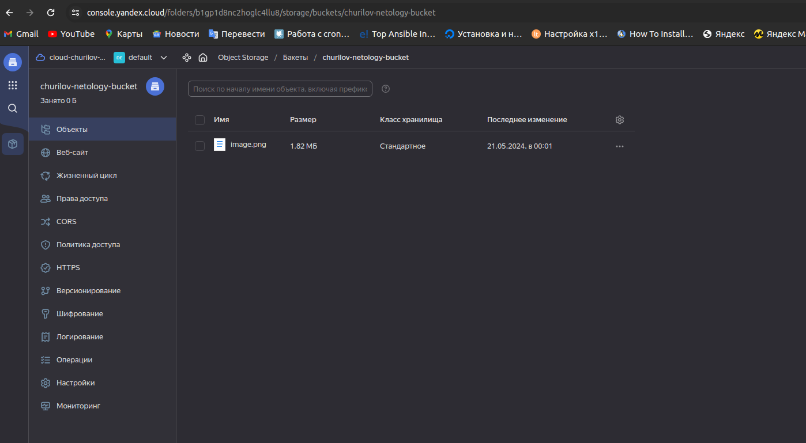

# Домашнее задание к занятию «Безопасность в облачных провайдерах»  

Используя конфигурации, выполненные в рамках предыдущих домашних заданий, нужно добавить возможность шифрования бакета.

---
## Задание 1. Yandex Cloud   

1. С помощью ключа в KMS необходимо зашифровать содержимое бакета:

 - создать ключ в KMS;
 - с помощью ключа зашифровать содержимое бакета, созданного ранее.
2. (Выполняется не в Terraform)* Создать статический сайт в Object Storage c собственным публичным адресом и сделать доступным по HTTPS:

 - создать сертификат;
 - создать статическую страницу в Object Storage и применить сертификат HTTPS;
 - в качестве результата предоставить скриншот на страницу с сертификатом в заголовке (замочек).

Полезные документы:

- [Настройка HTTPS статичного сайта](https://cloud.yandex.ru/docs/storage/operations/hosting/certificate).
- [Object Storage bucket](https://registry.terraform.io/providers/yandex-cloud/yandex/latest/docs/resources/storage_bucket).
- [KMS key](https://registry.terraform.io/providers/yandex-cloud/yandex/latest/docs/resources/kms_symmetric_key).

--- 
## Ответ:

[Конфиги Terraform](https://github.com/ChuckBartowski13/devops-netology/tree/main/15.3/terraform)

```
ret@ret-vm:~/HOMEWORK/temp/devops-netology/15.3/terraform/test$ terraform plan

Terraform used the selected providers to generate the following execution plan.
Resource actions are indicated with the following symbols:
  + create

Terraform will perform the following actions:

  # yandex_iam_service_account.sa-bucket will be created
  + resource "yandex_iam_service_account" "sa-bucket" {
      + created_at = (known after apply)
      + folder_id  = (known after apply)
      + id         = (known after apply)
      + name       = "sa-backet"
    }

  # yandex_iam_service_account_static_access_key.sa-static-key will be created
  + resource "yandex_iam_service_account_static_access_key" "sa-static-key" {
      + access_key           = (known after apply)
      + created_at           = (known after apply)
      + description          = "static access key for bucket"
      + encrypted_secret_key = (known after apply)
      + id                   = (known after apply)
      + key_fingerprint      = (known after apply)
      + secret_key           = (sensitive value)
      + service_account_id   = (known after apply)
    }

  # yandex_kms_symmetric_key.bo-key will be created
  + resource "yandex_kms_symmetric_key" "bo-key" {
      + created_at          = (known after apply)
      + default_algorithm   = "AES_256"
      + deletion_protection = false
      + description         = "Key for encrypting bucket objects"
      + folder_id           = (known after apply)
      + id                  = (known after apply)
      + name                = "my-entcryption-key"
      + rotated_at          = (known after apply)
      + rotation_period     = "8760h"
      + status              = (known after apply)
    }

  # yandex_resourcemanager_cloud_iam_member.bucket-editor will be created
  + resource "yandex_resourcemanager_cloud_iam_member" "bucket-editor" {
      + cloud_id = "b1gp7g3sgar05j2ih4en"
      + id       = (known after apply)
      + member   = (known after apply)
      + role     = "storage.editor"
    }

  # yandex_resourcemanager_cloud_iam_member.bucket-kms-decrypter will be created
  + resource "yandex_resourcemanager_cloud_iam_member" "bucket-kms-decrypter" {
      + cloud_id = "b1gp7g3sgar05j2ih4en"
      + id       = (known after apply)
      + member   = (known after apply)
      + role     = "kms.keys.decrypter"
    }

  # yandex_resourcemanager_cloud_iam_member.bucket-kms-encrypter will be created
  + resource "yandex_resourcemanager_cloud_iam_member" "bucket-kms-encrypter" {
      + cloud_id = "b1gp7g3sgar05j2ih4en"
      + id       = (known after apply)
      + member   = (known after apply)
      + role     = "kms.keys.encrypter"
    }

  # yandex_storage_bucket.netology-bucket will be created
  + resource "yandex_storage_bucket" "netology-bucket" {
      + access_key            = (known after apply)
      + acl                   = "public-read"
      + bucket                = "churilov-netology-bucket"
      + bucket_domain_name    = (known after apply)
      + default_storage_class = (known after apply)
      + folder_id             = (known after apply)
      + force_destroy         = false
      + id                    = (known after apply)
      + secret_key            = (sensitive value)
      + website_domain        = (known after apply)
      + website_endpoint      = (known after apply)

      + anonymous_access_flags {
          + config_read = true
          + list        = true
          + read        = true
        }

      + server_side_encryption_configuration {
          + rule {
              + apply_server_side_encryption_by_default {
                  + kms_master_key_id = (known after apply)
                  + sse_algorithm     = "aws:kms"
                }
            }
        }
    }

  # yandex_storage_object.object will be created
  + resource "yandex_storage_object" "object" {
      + access_key   = (known after apply)
      + acl          = "public-read"
      + bucket       = "churilov-netology-bucket"
      + content_type = (known after apply)
      + id           = (known after apply)
      + key          = "image.png"
      + secret_key   = (sensitive value)
      + source       = "image.png"
    }

Plan: 8 to add, 0 to change, 0 to destroy.

───────────────────────────────────────────────────────────────────────────────

Note: You didn't use the -out option to save this plan, so Terraform can't
guarantee to take exactly these actions if you run "terraform apply" now.
ret@ret-vm:~/HOMEWORK/temp/devops-netology/15.3/terraform/test$ terraform apply

Terraform used the selected providers to generate the following execution plan.
Resource actions are indicated with the following symbols:
  + create

Terraform will perform the following actions:

  # yandex_iam_service_account.sa-bucket will be created
  + resource "yandex_iam_service_account" "sa-bucket" {
      + created_at = (known after apply)
      + folder_id  = (known after apply)
      + id         = (known after apply)
      + name       = "sa-backet"
    }

  # yandex_iam_service_account_static_access_key.sa-static-key will be created
  + resource "yandex_iam_service_account_static_access_key" "sa-static-key" {
      + access_key           = (known after apply)
      + created_at           = (known after apply)
      + description          = "static access key for bucket"
      + encrypted_secret_key = (known after apply)
      + id                   = (known after apply)
      + key_fingerprint      = (known after apply)
      + secret_key           = (sensitive value)
      + service_account_id   = (known after apply)
    }

  # yandex_kms_symmetric_key.bo-key will be created
  + resource "yandex_kms_symmetric_key" "bo-key" {
      + created_at          = (known after apply)
      + default_algorithm   = "AES_256"
      + deletion_protection = false
      + description         = "Key for encrypting bucket objects"
      + folder_id           = (known after apply)
      + id                  = (known after apply)
      + name                = "my-entcryption-key"
      + rotated_at          = (known after apply)
      + rotation_period     = "8760h"
      + status              = (known after apply)
    }

  # yandex_resourcemanager_cloud_iam_member.bucket-editor will be created
  + resource "yandex_resourcemanager_cloud_iam_member" "bucket-editor" {
      + cloud_id = "b1gp7g3sgar05j2ih4en"
      + id       = (known after apply)
      + member   = (known after apply)
      + role     = "storage.editor"
    }

  # yandex_resourcemanager_cloud_iam_member.bucket-kms-decrypter will be created
  + resource "yandex_resourcemanager_cloud_iam_member" "bucket-kms-decrypter" {
      + cloud_id = "b1gp7g3sgar05j2ih4en"
      + id       = (known after apply)
      + member   = (known after apply)
      + role     = "kms.keys.decrypter"
    }

  # yandex_resourcemanager_cloud_iam_member.bucket-kms-encrypter will be created
  + resource "yandex_resourcemanager_cloud_iam_member" "bucket-kms-encrypter" {
      + cloud_id = "b1gp7g3sgar05j2ih4en"
      + id       = (known after apply)
      + member   = (known after apply)
      + role     = "kms.keys.encrypter"
    }

  # yandex_storage_bucket.netology-bucket will be created
  + resource "yandex_storage_bucket" "netology-bucket" {
      + access_key            = (known after apply)
      + acl                   = "public-read"
      + bucket                = "churilov-netology-bucket"
      + bucket_domain_name    = (known after apply)
      + default_storage_class = (known after apply)
      + folder_id             = (known after apply)
      + force_destroy         = false
      + id                    = (known after apply)
      + secret_key            = (sensitive value)
      + website_domain        = (known after apply)
      + website_endpoint      = (known after apply)

      + anonymous_access_flags {
          + config_read = true
          + list        = true
          + read        = true
        }

      + server_side_encryption_configuration {
          + rule {
              + apply_server_side_encryption_by_default {
                  + kms_master_key_id = (known after apply)
                  + sse_algorithm     = "aws:kms"
                }
            }
        }
    }

  # yandex_storage_object.object will be created
  + resource "yandex_storage_object" "object" {
      + access_key   = (known after apply)
      + acl          = "public-read"
      + bucket       = "churilov-netology-bucket"
      + content_type = (known after apply)
      + id           = (known after apply)
      + key          = "image.png"
      + secret_key   = (sensitive value)
      + source       = "image.png"
    }

Plan: 8 to add, 0 to change, 0 to destroy.

Do you want to perform these actions?
  Terraform will perform the actions described above.
  Only 'yes' will be accepted to approve.

  Enter a value: yes

yandex_iam_service_account.sa-bucket: Creating...
yandex_kms_symmetric_key.bo-key: Creating...
yandex_kms_symmetric_key.bo-key: Creation complete after 1s [id=abj1rf31h4d7avc57855]
yandex_iam_service_account.sa-bucket: Creation complete after 2s [id=ajej67gd0d805thb0ibd]
yandex_resourcemanager_cloud_iam_member.bucket-kms-encrypter: Creating...
yandex_iam_service_account_static_access_key.sa-static-key: Creating...
yandex_resourcemanager_cloud_iam_member.bucket-editor: Creating...
yandex_resourcemanager_cloud_iam_member.bucket-kms-decrypter: Creating...
yandex_iam_service_account_static_access_key.sa-static-key: Creation complete after 2s [id=ajesr21ael6tusj7g0mi]
yandex_storage_bucket.netology-bucket: Creating...
yandex_resourcemanager_cloud_iam_member.bucket-kms-encrypter: Creation complete after 3s [id=b1gp7g3sgar05j2ih4en/kms.keys.encrypter/serviceAccount:ajej67gd0d805thb0ibd]
yandex_resourcemanager_cloud_iam_member.bucket-kms-decrypter: Creation complete after 5s [id=b1gp7g3sgar05j2ih4en/kms.keys.decrypter/serviceAccount:ajej67gd0d805thb0ibd]
yandex_resourcemanager_cloud_iam_member.bucket-editor: Creation complete after 8s [id=b1gp7g3sgar05j2ih4en/storage.editor/serviceAccount:ajej67gd0d805thb0ibd]
yandex_storage_bucket.netology-bucket: Still creating... [10s elapsed]
yandex_storage_bucket.netology-bucket: Still creating... [20s elapsed]
yandex_storage_bucket.netology-bucket: Still creating... [30s elapsed]
yandex_storage_bucket.netology-bucket: Still creating... [40s elapsed]
yandex_storage_bucket.netology-bucket: Still creating... [50s elapsed]
yandex_storage_bucket.netology-bucket: Still creating... [1m0s elapsed]
yandex_storage_bucket.netology-bucket: Still creating... [1m10s elapsed]
yandex_storage_bucket.netology-bucket: Creation complete after 1m14s [id=churilov-netology-bucket]
yandex_storage_object.object: Creating...
yandex_storage_object.object: Creation complete after 2s [id=image.png]

Apply complete! Resources: 8 added, 0 changed, 0 destroyed.
ret@ret-vm:~/HOMEWORK/temp/devops-netology/15.3/terraform/test$ terraform destroy
yandex_iam_service_account.sa-bucket: Refreshing state... [id=ajej67gd0d805thb0ibd]
yandex_kms_symmetric_key.bo-key: Refreshing state... [id=abj1rf31h4d7avc57855]
yandex_resourcemanager_cloud_iam_member.bucket-editor: Refreshing state... [id=b1gp7g3sgar05j2ih4en/storage.editor/serviceAccount:ajej67gd0d805thb0ibd]
yandex_resourcemanager_cloud_iam_member.bucket-kms-decrypter: Refreshing state... [id=b1gp7g3sgar05j2ih4en/kms.keys.decrypter/serviceAccount:ajej67gd0d805thb0ibd]
yandex_resourcemanager_cloud_iam_member.bucket-kms-encrypter: Refreshing state... [id=b1gp7g3sgar05j2ih4en/kms.keys.encrypter/serviceAccount:ajej67gd0d805thb0ibd]
yandex_iam_service_account_static_access_key.sa-static-key: Refreshing state... [id=ajesr21ael6tusj7g0mi]
yandex_storage_bucket.netology-bucket: Refreshing state... [id=churilov-netology-bucket]
yandex_storage_object.object: Refreshing state... [id=image.png]

Terraform used the selected providers to generate the following execution plan. Resource actions are indicated with the following symbols:
  - destroy

Terraform will perform the following actions:

  # yandex_iam_service_account.sa-bucket will be destroyed
  - resource "yandex_iam_service_account" "sa-bucket" {
      - created_at  = "2024-05-20T21:00:03Z" -> null
      - folder_id   = "b1gp1d8nc2hoglc4llu8" -> null
      - id          = "ajej67gd0d805thb0ibd" -> null
      - name        = "sa-backet" -> null
        # (1 unchanged attribute hidden)
    }

  # yandex_iam_service_account_static_access_key.sa-static-key will be destroyed
  - resource "yandex_iam_service_account_static_access_key" "sa-static-key" {
      - access_key         = "YCAJE7dsrzjID8iON0tAGWcJp" -> null
      - created_at         = "2024-05-20T21:00:05Z" -> null
      - description        = "static access key for bucket" -> null
      - id                 = "ajesr21ael6tusj7g0mi" -> null
      - secret_key         = (sensitive value) -> null
      - service_account_id = "ajej67gd0d805thb0ibd" -> null
    }

  # yandex_kms_symmetric_key.bo-key will be destroyed
  - resource "yandex_kms_symmetric_key" "bo-key" {
      - created_at          = "2024-05-20T21:00:03Z" -> null
      - default_algorithm   = "AES_256" -> null
      - deletion_protection = false -> null
      - description         = "Key for encrypting bucket objects" -> null
      - folder_id           = "b1gp1d8nc2hoglc4llu8" -> null
      - id                  = "abj1rf31h4d7avc57855" -> null
      - labels              = {} -> null
      - name                = "my-entcryption-key" -> null
      - rotation_period     = "8760h0m0s" -> null
      - status              = "active" -> null
        # (1 unchanged attribute hidden)
    }

  # yandex_resourcemanager_cloud_iam_member.bucket-editor will be destroyed
  - resource "yandex_resourcemanager_cloud_iam_member" "bucket-editor" {
      - cloud_id = "b1gp7g3sgar05j2ih4en" -> null
      - id       = "b1gp7g3sgar05j2ih4en/storage.editor/serviceAccount:ajej67gd0d805thb0ibd" -> null
      - member   = "serviceAccount:ajej67gd0d805thb0ibd" -> null
      - role     = "storage.editor" -> null
    }

  # yandex_resourcemanager_cloud_iam_member.bucket-kms-decrypter will be destroyed
  - resource "yandex_resourcemanager_cloud_iam_member" "bucket-kms-decrypter" {
      - cloud_id = "b1gp7g3sgar05j2ih4en" -> null
      - id       = "b1gp7g3sgar05j2ih4en/kms.keys.decrypter/serviceAccount:ajej67gd0d805thb0ibd" -> null
      - member   = "serviceAccount:ajej67gd0d805thb0ibd" -> null
      - role     = "kms.keys.decrypter" -> null
    }

  # yandex_resourcemanager_cloud_iam_member.bucket-kms-encrypter will be destroyed
  - resource "yandex_resourcemanager_cloud_iam_member" "bucket-kms-encrypter" {
      - cloud_id = "b1gp7g3sgar05j2ih4en" -> null
      - id       = "b1gp7g3sgar05j2ih4en/kms.keys.encrypter/serviceAccount:ajej67gd0d805thb0ibd" -> null
      - member   = "serviceAccount:ajej67gd0d805thb0ibd" -> null
      - role     = "kms.keys.encrypter" -> null
    }

  # yandex_storage_bucket.netology-bucket will be destroyed
  - resource "yandex_storage_bucket" "netology-bucket" {
      - access_key            = "YCAJE7dsrzjID8iON0tAGWcJp" -> null
      - acl                   = "public-read" -> null
      - bucket                = "churilov-netology-bucket" -> null
      - bucket_domain_name    = "churilov-netology-bucket.storage.yandexcloud.net" -> null
      - default_storage_class = "STANDARD" -> null
      - folder_id             = "b1gp1d8nc2hoglc4llu8" -> null
      - force_destroy         = false -> null
      - id                    = "churilov-netology-bucket" -> null
      - max_size              = 0 -> null
      - secret_key            = (sensitive value) -> null
      - tags                  = {} -> null
        # (1 unchanged attribute hidden)

      - anonymous_access_flags {
          - config_read = true -> null
          - list        = true -> null
          - read        = true -> null
        }

      - server_side_encryption_configuration {
          - rule {
              - apply_server_side_encryption_by_default {
                  - kms_master_key_id = "abj1rf31h4d7avc57855" -> null
                  - sse_algorithm     = "aws:kms" -> null
                }
            }
        }

      - versioning {
          - enabled = false -> null
        }
    }

  # yandex_storage_object.object will be destroyed
  - resource "yandex_storage_object" "object" {
      - access_key   = "YCAJE7dsrzjID8iON0tAGWcJp" -> null
      - acl          = "public-read" -> null
      - bucket       = "churilov-netology-bucket" -> null
      - content_type = "application/octet-stream" -> null
      - id           = "image.png" -> null
      - key          = "image.png" -> null
      - secret_key   = (sensitive value) -> null
      - source       = "image.png" -> null
      - tags         = {} -> null
    }

Plan: 0 to add, 0 to change, 8 to destroy.

Do you really want to destroy all resources?
  Terraform will destroy all your managed infrastructure, as shown above.
  There is no undo. Only 'yes' will be accepted to confirm.

  Enter a value: yes

yandex_resourcemanager_cloud_iam_member.bucket-kms-encrypter: Destroying... [id=b1gp7g3sgar05j2ih4en/kms.keys.encrypter/serviceAccount:ajej67gd0d805thb0ibd]
yandex_resourcemanager_cloud_iam_member.bucket-kms-decrypter: Destroying... [id=b1gp7g3sgar05j2ih4en/kms.keys.decrypter/serviceAccount:ajej67gd0d805thb0ibd]
yandex_resourcemanager_cloud_iam_member.bucket-editor: Destroying... [id=b1gp7g3sgar05j2ih4en/storage.editor/serviceAccount:ajej67gd0d805thb0ibd]
yandex_storage_object.object: Destroying... [id=image.png]
yandex_storage_object.object: Destruction complete after 1s
yandex_storage_bucket.netology-bucket: Destroying... [id=churilov-netology-bucket]
yandex_resourcemanager_cloud_iam_member.bucket-kms-decrypter: Destruction complete after 4s
yandex_resourcemanager_cloud_iam_member.bucket-editor: Destruction complete after 6s
yandex_resourcemanager_cloud_iam_member.bucket-kms-encrypter: Destruction complete after 8s
yandex_storage_bucket.netology-bucket: Still destroying... [id=churilov-netology-bucket, 10s elapsed]
yandex_storage_bucket.netology-bucket: Destruction complete after 11s
yandex_iam_service_account_static_access_key.sa-static-key: Destroying... [id=ajesr21ael6tusj7g0mi]
yandex_kms_symmetric_key.bo-key: Destroying... [id=abj1rf31h4d7avc57855]
yandex_iam_service_account_static_access_key.sa-static-key: Destruction complete after 0s
yandex_iam_service_account.sa-bucket: Destroying... [id=ajej67gd0d805thb0ibd]
yandex_kms_symmetric_key.bo-key: Destruction complete after 0s
yandex_iam_service_account.sa-bucket: Destruction complete after 3s

Destroy complete! Resources: 8 destroyed.
ret@ret-vm:~/HOMEWORK/temp/devops-netology/15.3/terraform/test$ 
```





