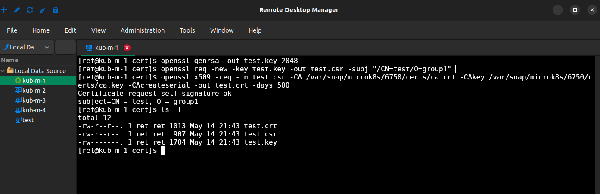
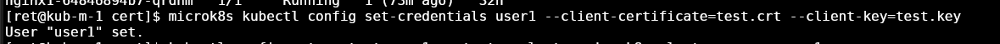
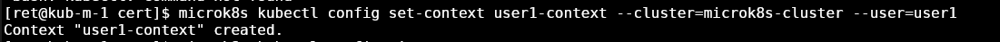
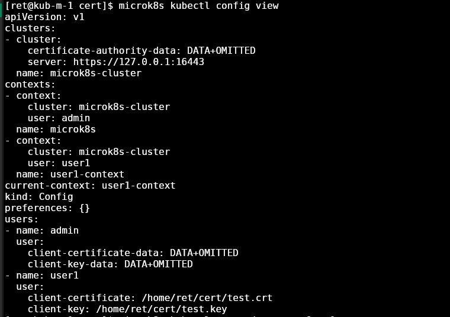
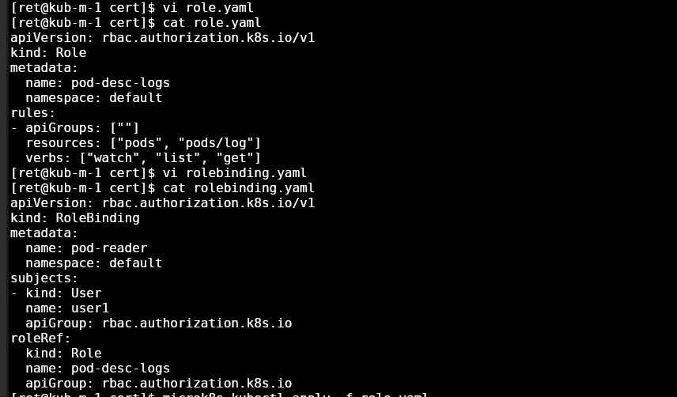
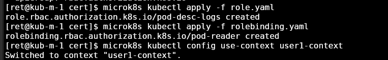

# Домашнее задание к занятию «Управление доступом»

### Цель задания

В тестовой среде Kubernetes нужно предоставить ограниченный доступ пользователю.

------

### Чеклист готовности к домашнему заданию

1. Установлено k8s-решение, например MicroK8S.
2. Установленный локальный kubectl.
3. Редактор YAML-файлов с подключённым github-репозиторием.

------

### Инструменты / дополнительные материалы, которые пригодятся для выполнения задания

1. [Описание](https://kubernetes.io/docs/reference/access-authn-authz/rbac/) RBAC.
2. [Пользователи и авторизация RBAC в Kubernetes](https://habr.com/ru/company/flant/blog/470503/).
3. [RBAC with Kubernetes in Minikube](https://medium.com/@HoussemDellai/rbac-with-kubernetes-in-minikube-4deed658ea7b).

------

### Задание 1. Создайте конфигурацию для подключения пользователя

1. Создайте и подпишите SSL-сертификат для подключения к кластеру.
2. Настройте конфигурационный файл kubectl для подключения.
3. Создайте роли и все необходимые настройки для пользователя.
4. Предусмотрите права пользователя. Пользователь может просматривать логи подов и их конфигурацию (`kubectl logs pod <pod_id>`, `kubectl describe pod <pod_id>`).
5. Предоставьте манифесты и скриншоты и/или вывод необходимых команд.

------

### Ответ: 
Все указанное выполнил - прикладываю в виде скриншотов и листингов результыты действий






```
[ret@kub-m-1 ~]$ microk8s kubectl get roles
NAME            CREATED AT
pod-desc-logs   2024-05-14T21:24:00Z
[ret@kub-m-1 ~]$ microk8s kubectl get role pod-desc-logs -o yaml
apiVersion: rbac.authorization.k8s.io/v1
kind: Role
metadata:
  annotations:
    kubectl.kubernetes.io/last-applied-configuration: |
      {"apiVersion":"rbac.authorization.k8s.io/v1","kind":"Role","metadata":{"annotations":{},"name":"pod-desc-logs","namespace":"default"},"rules":[{"apiGroups":[""],"resources":["pods","pods/log"],"verbs":["watch","list","get"]}]}
  creationTimestamp: "2024-05-14T21:24:00Z"
  name: pod-desc-logs
  namespace: default
  resourceVersion: "12222548"
  uid: 5f883326-b198-4d39-bbd2-cd01aa07be73
rules:
- apiGroups:
  - ""
  resources:
  - pods
  - pods/log
  verbs:
  - watch
  - list
  - get
[ret@kub-m-1 ~]$ microk8s kubectl get rolebindings
NAME         ROLE                 AGE
pod-reader   Role/pod-desc-logs   28m
[ret@kub-m-1 ~]$ microk8s kubectl get rolebinding pod-reader -o yaml
apiVersion: rbac.authorization.k8s.io/v1
kind: RoleBinding
metadata:
  annotations:
    kubectl.kubernetes.io/last-applied-configuration: |
      {"apiVersion":"rbac.authorization.k8s.io/v1","kind":"RoleBinding","metadata":{"annotations":{},"name":"pod-reader","namespace":"default"},"roleRef":{"apiGroup":"rbac.authorization.k8s.io","kind":"Role","name":"pod-desc-logs"},"subjects":[{"apiGroup":"rbac.authorization.k8s.io","kind":"User","name":"user1"}]}
  creationTimestamp: "2024-05-14T21:24:08Z"
  name: pod-reader
  namespace: default
  resourceVersion: "12222577"
  uid: 857beeb0-4bbb-4b0f-989e-55304fb2be04
roleRef:
  apiGroup: rbac.authorization.k8s.io
  kind: Role
  name: pod-desc-logs
subjects:
- apiGroup: rbac.authorization.k8s.io
  kind: User
  name: user1
[ret@kub-m-1 ~]$
```

```
[ret@kub-m-1 ~]$ microk8s kubectl config get-contexts
CURRENT   NAME            CLUSTER            AUTHINFO   NAMESPACE
          microk8s        microk8s-cluster   admin
*         user1-context   microk8s-cluster   user1
[ret@kub-m-1 ~]$
```

```
[ret@kub-m-1 ~]$ microk8s kubectl describe pod nginx-deployment-667fb657d5-9bksn
Name:             nginx-deployment-667fb657d5-9bksn
Namespace:        default
Priority:         0
Service Account:  default
Node:             kub-m-2/192.168.88.7
Start Time:       Mon, 22 Apr 2024 18:12:24 +0300
Labels:           app=nginx
                  pod-template-hash=667fb657d5
Annotations:      cni.projectcalico.org/containerID: 15e559c747ce3f497bb544a5f033e26644d80651c92511fb72aa3850f4ef2a6f
                  cni.projectcalico.org/podIP: 10.1.197.174/32
                  cni.projectcalico.org/podIPs: 10.1.197.174/32
Status:           Running
IP:               10.1.197.174
IPs:
  IP:           10.1.197.174
Controlled By:  ReplicaSet/nginx-deployment-667fb657d5
Containers:
  nginx:
    Container ID:   containerd://f36918c9bad53c1db09e7b35164aebb0ed4fd1fa02f25d508ff2085904ffcd36
    Image:          nginx:1.14.2
    Image ID:       docker.io/library/nginx@sha256:f7988fb6c02e0ce69257d9bd9cf37ae20a60f1df7563c3a2a6abe24160306b8d
    Port:           80/TCP
    Host Port:      0/TCP
    State:          Running
      Started:      Wed, 08 May 2024 17:16:05 +0300
    Last State:     Terminated
      Reason:       Unknown
      Exit Code:    255
      Started:      Mon, 22 Apr 2024 18:12:28 +0300
      Finished:     Wed, 08 May 2024 17:05:46 +0300
    Ready:          True
    Restart Count:  1
    Environment:    <none>
    Mounts:
      /usr/share/nginx/html from configmap-volume (rw)
      /var/run/secrets/kubernetes.io/serviceaccount from kube-api-access-ldccl (ro)
Conditions:
  Type              Status
  Initialized       True
  Ready             True
  ContainersReady   True
  PodScheduled      True
Volumes:
  configmap-volume:
    Type:      ConfigMap (a volume populated by a ConfigMap)
    Name:      netology-configmap-homepage
    Optional:  false
  kube-api-access-ldccl:
    Type:                    Projected (a volume that contains injected data from multiple sources)
    TokenExpirationSeconds:  3607
    ConfigMapName:           kube-root-ca.crt
    ConfigMapOptional:       <nil>
    DownwardAPI:             true
QoS Class:                   BestEffort
Node-Selectors:              <none>
Tolerations:                 node.kubernetes.io/not-ready:NoExecute op=Exists for 300s
                             node.kubernetes.io/unreachable:NoExecute op=Exists for 300s
Events:                      <none>

[ret@kub-m-1 ~]$ microk8s kubectl logs netology-deployment-957484778-nb78z
Defaulted container "nginx" out of: nginx, multitool
[ret@kub-m-1 ~]$ microk8s kubectl delete pod netology-deployment-957484778-nb78z
Error from server (Forbidden): pods "netology-deployment-957484778-nb78z" is forbidden: User "user1" cannot delete pods in API group "" in the namespace "default"
[ret@kub-m-1 ~]$ microk8s kubectl get deploy
Error from server (Forbidden): deployments.apps is forbidden: User "user1" cannot list resource "deployments" in API group "" in the namespace "default"
[ret@kub-m-1 ~]$ 
```
